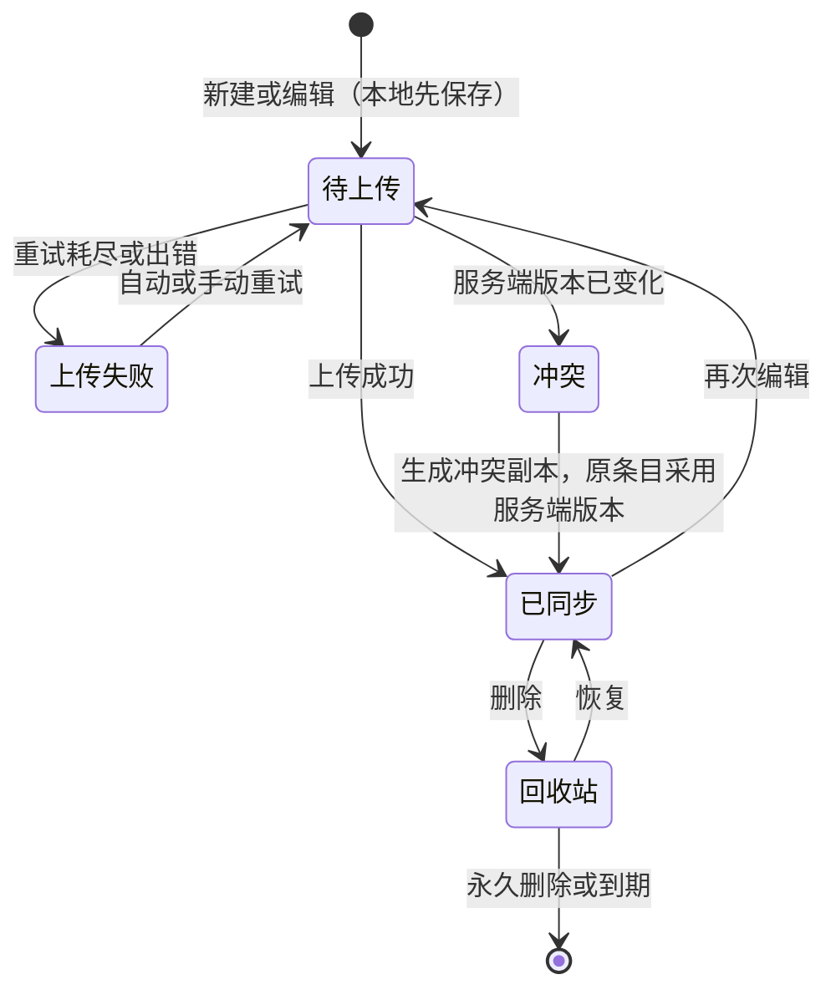
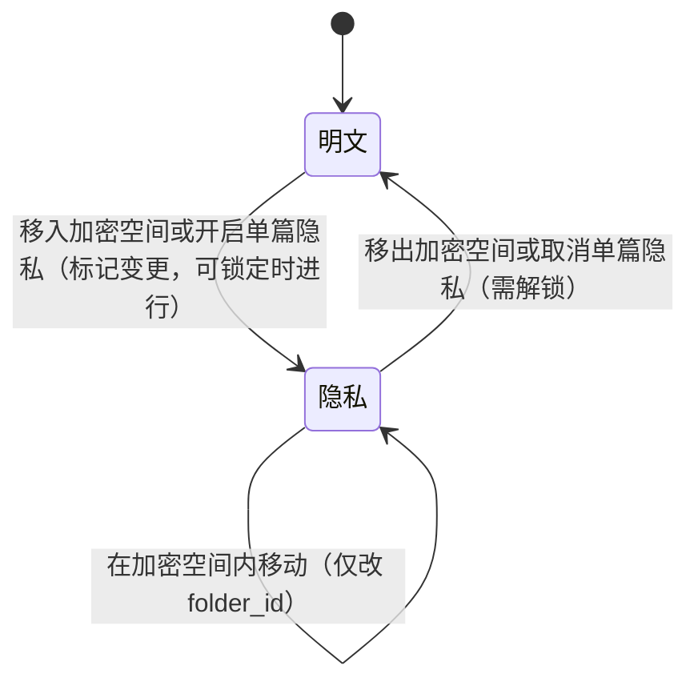
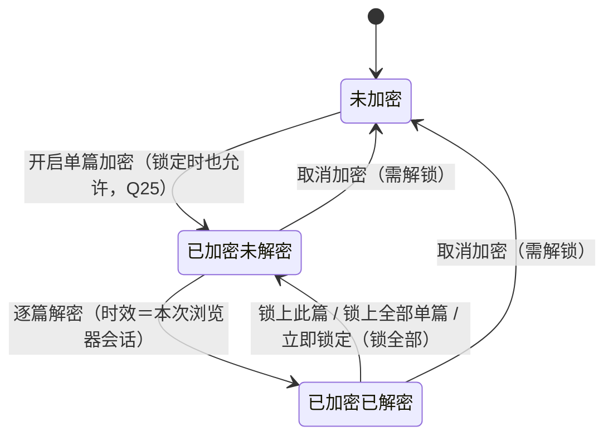

# Menote 功能拆解（v2）

| 项 | 内容 |
|---|---|
| 文档性质 | 产品功能拆解：把已定需求拆成可开发、可验收的功能点，并补齐每个功能的入口、流程、规则、异常和状态闭环 |
| 基准 | 仓库根目录 `Menote-设计文档-v7.4.md`（下文简称“需求文档”或“设计文档”）。本文不修改需求文档，所有功能点都标注来源小节。布局与交互另参照界面原型 `prototype/menote-prototype.html`（下文简称“原型”；引用只写界面元素名或选择器，如 `#topAccount`、`.nav-seg`，不写行号——行号随原型改动会失效） |
| 工作原则 | 功能与规则以设计文档为准，布局与交互以原型（prototype/menote-prototype.html）为准，冲突时由用户确认 |
| 版本 | v2.16（**设置页信息架构 11 类 → 9 类**（用户 2026-10-04 确认）：M18-01 的分类清单与 M18-02 的子页面表同步改写——**「编辑器」与「关于」两个分类撤销、内容并进「通用」**（分别是「编辑体验」卡与页面最底部的「关于 MeNote」卡），**原「数据管理」改名「附件」**（路由 id 仍是 `data`）；新增**设置项作用域标识**（`.scope-tag`，`本机` / `跟随账号`）与**撤销分类的显式重定向** `LEGACY_SETTINGS_PAGES`；页头删掉「分类总数」。起因是产品评估查出**粒度严重不均**（11 个等权重导航项里，「编辑器」整页 3 个开关而「隐私锁」5 张卡 381 行）。决定与影响面见 `docs/modules/Menote-M8-设置页信息架构-v1.md` v1。上一版 v2.15：M7 收口回写，M16-01 / M16-02 标「**M7 已落地**」并补记实现期的取舍与偏离——**首期只 WebDAV + S3（Git 后置，`kind` 的 CHECK 里也不放 `git`）**、**删除策略默认值由「同步删除」改为「只增不删」**（用户 2026-10-03 拍板）、**一轮一批 ≤40 外部 PUT**（架构 §14.3 的硬限额，推翻了原设计的「一轮 20 批」）、物化改增量、**架构 §7.3 那句「固定开销 103 字节」订正为 115**；M16-03 标「**部分落地**」——「推一次」已实做，**浏览器循环 + 进度条 + 中断续传未做**并如实登记） |
| 日期 | 2026-10-04 |
| 状态 | 第十四稿。**v2.16 回写「设置页信息架构 11 类 → 9 类」**（用户 2026-10-04 确认）：M18-01 分类清单与 M18-02 子页面表同步改写；**「编辑器」「关于」两分类撤销、内容并进「通用」**（前者成「编辑体验」卡、后者成最底部的「关于 MeNote」卡），**原「数据管理」改名「附件」**（id 仍 `data`，老深链不失效）；新增**设置项作用域标识**（`.scope-tag`）与**撤销分类的显式重定向**（`LEGACY_SETTINGS_PAGES`）；页头删掉「分类总数」；两处「后续定」改为如实陈述「尚未提供」。v2.12 回写**M5 分享收口**（M14-01~05 补实现状态与代码落点、M14-02 定为首期后置、Q18 由「待确认」改「已定」、M18 设置分类表补「备份与导出」与「分享」已进导航及实例管理的「分享子域」行）。v2.11 回写**正文编辑模式的档位口径**（M04-03 与设置分类表两处：产品只有**三档**——仅编辑 / 仅预览 / 即时渲染，`双栏` 已从产品移除、旧值只读兼容；设置只决定**显示哪几档**、**没有「默认档」**，`editor_mode` 只是首次初始值，打开笔记用本机记住的「上次用的那一档」，新用户三档全开；阅读态由「仅预览」承担）；v2.10 只回写 **Memo / 待办视图「添加」按钮改为「添加内容窗口」弹窗**（M06-01、M06-10、M07-01、M07-05 与功能栏概览五处：点「添加」**不再跳回左侧功能栏的录入框**，改单独弹窗、发布后立刻在列表看到新条目；用户 2026-09-29 要求"给明确反馈"，并要"一个通用的内容输入窗口、非笔记类共用、字段随类型换"）；v2.9 只回写**功能栏标签区的位置**（M02-02：标签从「导航区（可滚动）」那一行挪到**贴底固定段**，用户 2026-09-29 要求"标签区不要被笔记本里的内容推挤、预留底部约 1/4～1/3、标签用按钮铺开"）；v2.8 只按用户 2026-09-29 的决定回写**加密空间的可展开形态**（§9.2 与隐私锁矩阵两处：功能栏那条贴底节点只作入口，空间内文件夹树落到空间视图的列表列里）；v2.7 回写编辑模式的设置侧（M04-03 与设置分类表两处：改成开关组"显示哪几档"、至少留一档，打开笔记用上次用的那一档）；v2.6 是 **M4 收口回写**：在 M05 / M10 / M11 / M12 / M18 追加 20 处「M4 落地补记」（按实现写明入口、规则与未做项），旧结论一字未改；v2.5 按《隐私锁设计 v1.3》回写隐私锁相关条目，Q4 / Q14 / Q15 / Q25 确认，设置分类增至 11 个 |
| 不包含 | 技术实现（接口、表结构、同步算法细节）归项目架构文档；本文只写到“用户看到什么、系统必须保证什么” |

### 标注约定

| 标注 | 含义 |
|---|---|
| `§8.9` | 该功能点在需求文档中的来源小节 |
| 【已定】 | 需求文档已明确，本文只做拆解 |
| 【补全】 | 需求文档未写明，但由已定规则可以直接推出，不改变任何决定 |
| 【建议·待确认 Qn】 | 需求文档未定义或有矛盾，本文给出建议写法，需在第十章第 n 条确认 |
| 【后续定】 | 需求文档明确列入“后续深入设计清单”的事项，本文只保留占位，不展开 |
| 【已定·用户确认 2026-09-26】 | 用户（产品负责人）于 2026-09-26 确认的决定。与需求文档 v7.4 不同时，在该处注明“与设计文档 v7.4 §x 不同，经用户确认；设计文档待同步” |
| 【已定·用户确认 2026-09-27】 | 用户于 2026-09-27 按《隐私锁设计 v1.3》确认的决定（写法同上）；被其推翻的旧句就地标“作废”，不留两套生效口径 |
| 【暂定·用户确认 2026-09-26】 | 用户同意暂按此写法（多为按原型），以后可能调整；其中仍未决定的部分保留在第十章 |

### 修订记录

| 版本 | 日期 | 内容 |
|---|---|---|
| v1 | 2026-09-25 | 初稿 |
| v2 | 2026-09-26 | 按用户确认的决定修订，明细见下 |
| v2.1 | 2026-09-26 | 原型定稿后的同步修订，明细见下 |
| v2.2 | 2026-09-26 | 补上设置页的两栏分页结构（M18-01），原型与框架页同步 |
| v2.3 | 2026-09-26 | 更正账户入口：点头像弹快捷菜单（「设置」在菜单里），菜单内容可在 设置 › 通用 › 快捷菜单 配置 |
| v2.4 | 2026-09-26 | M1 开工前同步【已定·用户确认 2026-09-26】：①M01-04 的登出缓存问题（Q22）定为**不清除本机明文缓存**；②M18-01 的实例级设置存放形态定为用 `app_meta` 键承载，**不新建 `site_settings` 表**（与需求 §18.2 的 DDL 对齐） |
| v2.5 | 2026-09-27 | 应用版本 v0.3.2。按《隐私锁设计 v1.3》回写隐私锁：【已定·用户确认 2026-09-27】解锁档位四档改三档（删「仅本次查看」，M08-05 作废）；加密空间锁定时**照常显示条目数**且是隐私范围默认成员；单篇加密改**独立门禁 + 逐篇解密**；整夹移入 / 移出（含锁定态入根目录）；状态标识改两套；关闭隐私锁规则定稿；设置项改「范围配置 + 三档 + 解锁时可搜索」（不含 AI 可见性）；§9.1 / §9.2 / §9.4 与 M09-02 重写、M17-03 计数口径、M18 分类增至 11 个（新增「关于」）；Q4 / Q13 / Q14 / Q15 / Q25 标已确认；第十一章标注同步状态（修改模型ID：deepseek-v4.1-flash） |
| v2.6 | 2026-09-27 | 应用版本 v0.4.25（M4 收口期间的写回；里程碑版本为 v0.5.0）。**M4 收口回写**（M4 设计 §九 第 6 行）：在 M05 / M10 / M11 / M12 / M18 共 **20 处**追加「**【M4 落地补记 2026-09-27】**」段落——按实现写明入口、规则与**未做项**，不改任何旧结论、不删旧句。要点：**M05** 列面板是弹窗（新建态不可点遮罩关）、列头菜单只三个入口、增删改列一律走面板、`_id` 列禁用项带原因、十种类型的承载控件与选项维护位置、行操作四件与"拖动柄未做"、筛选条内嵌 + "筛选后 N / M 行" + 排序从列头菜单进、图册无图片列时**给出口而不是只置灰**、图片单元格"附件不可用"灰提示；**M10** 缩略图浏览器端生成、正文引用写法定稿、进度落既有状态栏、引用只在上传时上报（集合对齐留 M6）、新增 **M10-新**（删除附件引用入口：M4 未做、待拍板）；**M11** 中文原因映射集中 `packages/shared` 且不回落英文、行上加保留标记（页脚汇总未做）、回滚语义四步与"恢复前封存必须在确认框可见"、可否取消保留待拍板；**M12** 四处删除入口与"撤销放在面板提示"、回收站四列 + 剩余天数 + 批量分批进度 + 空态三段、恢复回原位/回根、永久删除单 batch 共享 `sync_seq` 与"是否提快照待拍板"；**M18-02** 「版本与回收站」六块行清单与三条口径（改自 AI）（修改模型ID：deepseek-v4.1-flash） |
| v2.10 | 2026-09-29 | 应用版本 v0.5.26。**回写「添加」按钮改弹窗**（用户 2026-09-29："点添加不要跳左侧快捷输入栏，单独弹窗添加、给明确反馈"；并要"一个通用的内容输入窗口，只给非笔记类，不同类型复用同一窗口结构、字段随类型换"）：Memo / 待办视图页头与空状态的「添加」由"跳回左侧录入框并切档"改为**打开「添加内容窗口」**（`app/fnbar/AddEntryDialog.tsx`，一个结构两种 kind——Memo 正文 + 含 `- [ ]` 时的「设为清单？」、待办截止 + 优先级，字段与录入框对应档一致；发布后 toast + 列表立刻刷新）；Memo 瀑布流空状态出口改「切回时间轴」。改 M06-01、M06-10、M07-01、M07-05 与功能栏概览五处（修改模型ID：mimo-v2.6-flash） |
| v2.11 | 2026-09-29 | 应用版本 v0.6.2。**回写正文编辑模式的档位口径**（编辑拓展专项阶段 A–D 全部完成，版本 v0.6.0 / v0.6.1 / v0.6.2；实施计划已归档到 `docs/archive/Menote-编辑拓展-实施计划-v1.md`）：产品只有**三档**——仅编辑（`edit`）/ 仅预览（`preview`）/ 即时渲染（`live`），显示顺序即 `edit → preview → live`；**双栏（`split`）已从产品移除**（阶段 A / v0.6.0，`EditorModeSchema` / `EDITOR_MODES` 仍读得进旧值、`normalizeEditorModes()` 是唯一归一化入口，UI 与新写入只产生三档）；设置 › 编辑器 是"显示哪几档"的开关组、**没有「默认档」**（`editor_mode` 只是首次初始值；新用户 `editor_modes` 默认三档全开，打开笔记用本机记住的「上次用的那一档」）；阅读态由「仅预览」承担（不新增只读即时渲染，`readOnly` 只是 `Editor` 内部能力）；「仅编辑」永久保留为可见回退入口；表格在即时渲染与编辑下都保持源码。改 M04-03 与 M18-02 设置分类表两处（修改模型ID：deepseek-v4.1-flash） |
| v2.12 | 2026-10-03 | 应用版本 v0.6.17。**M5 分享收口回写**【已定·用户确认 2026-10-03】：①**M14 段补实现状态与代码落点**——M14-01/03/04/05 已落地（服务端 v0.6.13、管理端 v0.6.14、查看器 v0.6.15），段首加一段落点清单（worker 四个文件 + shared 契约 + 前端两个 feature，并注明**查看器由 `main.tsx` 按 `/s/<sid>` 动态 import、不是独立 html 入口**）；②**M14-02 定为首期后置**（用户 2026-10-02 拍板，`share_items` 表建好不接 UI）；③**M14-04 补「每次访问实时检查、不依赖 Cron」**与加密 / 进回收站时另做分享行清理与提示；④**M14-05 的表格形态由「建议·待确认 Q18」改为「已定·Q18」**（只读表格视图，有图片列时可切图册，不提供筛选排序——与第十一章 Q18 结论对齐，M14-05 的旧标注是漏改）；⑤**M18-01 补导航现状**：「备份与导出」「分享」已进导航、当前 9 类，「MCP」「数据管理」仍待 M6，并写明**导航清单以 `router.ts` 的 `SETTINGS_PAGES` 为唯一事实源**（本文 11 类是定稿目标、不是现状）；⑥**M18-02 表两行补落地**：分享行注明创建 / 复制 / 撤销在笔记弹窗、改密改期只在设置页；实例管理行新增「**分享子域**」（含留空语义、存 `app_meta`、需先在 Cloudflare 路由到同一 Worker）。（修改模型ID：MiniMax-M3.1-Flash-Preview） |
| v2.16 | 2026-10-04 | 应用版本 v0.8.4。**设置页信息架构 11 类 → 9 类**【已定·用户确认 2026-10-04】：起因是产品评估查出**粒度严重不均**——11 个**等权重**导航项的实际体量差两个数量级（「编辑器」整页只有 3 个开关约 30 行，而「隐私锁」5 张卡 381 行）。①**M18-01 分类清单** 11 → 9：通用 / 账户与安全 / 隐私锁 / 版本与回收站 / 备份 / 分享 / MCP / **附件** / 实例管理。②**「编辑器」与「关于」两个分类撤销、内容并进「通用」**（前者成「编辑体验」卡、后者成最底部的「关于 MeNote」卡；**控件与不变式一条没变，只换挂载页**；「关于」放最后是因为版本号是**低频查阅**内容，而放进 ⓘ 会让它不可见——报 bug 时要看）。③**原「数据管理」改名「附件」**：它本来就只管附件占用与孤儿清理，原名**承诺了比实际更多的东西**；与「备份与导出」的边界靠**改名字**划清而**不合并**（合并会让单页承载 7 张卡、重新制造体量方差）。④**新增设置项作用域标识** `.scope-tag`（`本机` / `跟随账号`）——**本次最实质的修复**：过去「主题」是设备级、其余是账号级，**区别只写在 ⓘ 悬停里**，用户对"我改完为什么另一台没变"毫无预期；作用域属**标识**不是说明性文字，**不进 `InfoHint`**。⑤**撤销分类须显式重定向** `LEGACY_SETTINGS_PAGES`（`editor`/`about` → `general`）：只从清单拿掉的话会被 `parseRoute` 那句"匹配不到就回落"**自动**接住，表现与 2026-09-27 修过的 bug **完全同形**（不报错、不白屏、只是安静落在别处）。⑥**M18-02 表**三处改写：通用行改写为四张卡并注明作用域；账户与安全 / 实例管理两行的「登录设备与会话」「成员账户管理」由**【后续定】改为【尚未提供】**（M6 已收口且未做，写"后续里程碑"等于宣称已排期；**占位行保留**）；备份行注明边界收窄、附件行注明改名与「个人用量未做」。⑦页头删掉「分类总数」（随角色变化易被误读为"漏了分类"），DESIGN.md §5.4-2 要求保持可见的**状态计数**（回收站条目数 / 令牌数 / 附件占用 / 推送进度）**全部保留**。**两处定稿未改**：需求 §7.5 子页面表、DESIGN.md §2.2「设置左列分类导航宽 184px」（9 类仍放得下）。（修改模型ID：MiniMax-M3.1-Flash-Preview） |
| v2.13 | 2026-10-03 | 应用版本 v0.6.20。**M6 第一批回写**【已定·用户确认 2026-10-03】：①**M10-03** 补「**保存正文时对齐引用集合**」已落地（M4 遗留 #2 销账）——`PUT /api/items/:id/body` 新增**可选**头 `X-Menote-Refs`（base64url 的 sha256 数组），**不带 = 引用表不动 / 带空数组 = 清空当前稿引用**；服务端在**保存正文的同一次写**里对齐（`DELETE` 当前稿 + 按 sha `INSERT`，`json_each` 压成一个绑定参数，按 `sha256`+`user_id` 反查并过滤 `kind='original'`——原图与缩略图**两行共用同一 sha256**，不过滤会重复挂引用）；**批量路径一起改了**（离线主路径）。**原子性是关键**：原先引用只在上传时上报，编辑删图后引用不对齐，只能靠「孤儿满 30 天」兜底，而那张仍在正文里显示的图会被真删。②**M14-04** 补「**失效分两层**」：实时检查之外，**软删 / 隐私标记置位时服务端真撤销分享行**（v0.6.19），并写明为何不能只靠客户端 `revokeItemShares`（那段每个 revoke 都被 try/catch 吞掉、且在另一台设备上恢复条目时根本不会跑）；用户 2026-10-03 拍板**回收站与加密同一口径**，解除加密不撤任何东西。③M10-新（删除引用入口）与 M10-03 的管理页仍属 M6 批 2b/2c，未做。（修改模型ID：MiniMax-M3.1-Flash-Preview） |

v2.3 修订内容（账户入口更正）：

1. **账户入口（M02-01）**：点头像**弹出快捷菜单**，「设置」是菜单里的一项 —— 不再直达设置页。v2.1 的“点击直接进设置、不弹菜单”作废（与新增①的关系见 10.0）。
2. **新增 M18-03 账户快捷菜单**：菜单结构（账户头 / 功能项 / 底部固定）、候选功能清单（主题切换、立即锁定、搜索、回收站、立即备份），配置入口在 设置 › 通用 › 快捷菜单，即时生效。
3. **M18-02** 通用行的设置项补「账户快捷菜单的配置项」。
4. 顺带修掉一处旧模型残留：锁定提示原是“内容已加密写入 outbox、解密图片地址已撤销”，与“服务端明文 + 前端门禁”的模型不符，改为“前端门禁已关闭，加密内容不再渲染、不进搜索结果（服务端存储方式不变）”。
5. 新增待确认 Q26（菜单里要不要放「新建」类动作）；第十一章增补第 19 条。

v2.2 修订内容（设置页补漏）：

1. **结构补漏**：此前本文与原型都只把设置项平铺成卡片，未体现 §7.5 的「左列分类导航 + 右侧当前分类内容」。现按 §7.5 落成两栏分页（M18-01），10 个分类一次只渲染一个。
2. **分类清单**照 §7.5 的子页面表，仅把「通用」提到首位作为默认落地页；「实例管理」只对 owner 显示，导航上带 `owner` 标记。
3. **Memo 隐私浏览**在 §7.5 里归入隐私锁子页面，界面仍独立成一张卡片，归在「隐私锁」分类下。
4. **补齐三个空页**：编辑器 / 数据管理 / 实例管理（v2.1 记为“原型省略”）本轮在原型中补上内容；回收站返回时落回「版本与回收站」分类，不回到默认分类。
5. 第十一章“需求文档待同步的用户决定”增补第 18 条。

v2.1 修订内容（原型定稿同步）：

1. 引用方式：全文 20 处 `P:行号` 改为引用界面元素（如顶栏账户入口 `#topAccount`、浏览三段 `.nav-seg`、快速录入框 `.composer`）。行号随原型每次改动都会失效，元素名稳定。
2. 术语统一（【已定·用户确认 2026-09-26】）：原本并用「加密空间」与「隐私空间」两个叫法，现**统一称“加密空间”**，导航项、页面标题、设置文案一并改。
3. 顶栏（M02-01）：由 5 块改为 **6 块**，末尾增加「账户与设置」圆形头像入口；功能栏底部的设置入口随之取消。
4. 功能栏（M02-02）：首页 / Memo / 待办三个纯视图跳转项压成一行「浏览三段」（下划线页签、不显示计数）；加密空间移出可滚动导航区、**贴底固定**，不设分组小标题；补写快速录入框的三行结构（已取消独立发布行）。
5. 首页统计口径（M02-03，【已定·用户确认 2026-09-26】）：条目统计与最近动态**始终计入**加密空间内条目，不因锁定 / 解锁改变口径；来自 Memo 的部分仍按门禁占位。原 Q7 中“锁定时统计不含加密空间内条目”的写法作废。
6. 记录类视图（M03-07）：最近编辑 / 收藏 / 标签与笔记本同构，改为「列表 + 正文」双栏，点条目在右列直接打开；滑出详情侧栏保留为通用能力，但不再由条目列表触发。
7. 加密空间内容隔离（M08-07）：空间内条目只在加密空间可见，不出现在最近编辑 / 收藏 / 标签的列表里；与“单篇加密但仍留在笔记本中”是两回事。
8. 恢复码删除（M08-13、M08-14、M08-16）：按 2026-09-26 隐私模型修订，恢复码整体取消；“忘记隐私密码”改为**直接重置**，重置不丢内容，唯一后果是此前导出的备份无法解密。
9. 入口闭合：新建文件夹与新建表格的入口定为笔记本节点右侧的 `+`（M03-02、M05-01）；界面偏好定为主题三选一（M18、M02-04）。
10. 10.0 增补本轮确认的四条决定；第十一章“需求文档待同步的用户决定”同步增补。

v2 修订内容：

1. 头部：增加工作原则（功能与规则以设计文档为准，布局与交互以原型为准，冲突时由用户确认）；新增标注【已定·用户确认 2026-09-26】和【暂定·用户确认 2026-09-26】。
2. 导航（Q1 已确认）：导航顺序定为首页、Memo、待办、最近编辑、收藏、笔记本、标签、加密空间；新增独立的“待办”导航项，原型中 Memo 视图内的“清单”tab（列表 / 看板）移到“待办”视图，Memo 视图只保留时间轴 / 瀑布流（M02-02、M06-10、M07-05）。
3. 快速录入框：保留 Memo / 待办 / 笔记三种模式切换，默认 Memo，是添加内容的主入口；Memo 视图和待办视图各有一个「添加」按钮；删除功能栏中单独的“待办”按钮（M02-02、M06-01、M07-01、M04-01）。与设计文档 §7.4 及变更记录第 12 条不同。
4. 回收站入口定在设置 › 版本与回收站（Q2 已确认，M12-02、M18）。
5. 搜索入口定在顶栏，快捷键 Ctrl+K / Cmd+K，结果在主操作区显示（Q3 已确认，M02-01、M09-01）。
6. 一次解锁同时解开 Memo 门禁和全部加密内容，界面只有一个锁定状态（Q5 已确认，M06-08）。
7. 最近编辑、收藏、标签三个视图都不包含 Memo（Q8 已确认）；Memo 因此不提供收藏，Q9 改为只讨论时间轴置顶；Memo 中的标签不会让 Memo 出现在标签视图，作为已接受的后果记录（M03-07、M06-06、9.1）。
8. 新建笔记、表格时不提供加密选项，单篇加密只在编辑器「更多」菜单中开关（M04-02、M08-08）。与设计文档 §6.2、§8.8 不同。
9. 允许在锁定状态下把条目移入加密空间（只能移到空间根目录，移入后立即锁定不可见）；补充技术可行性说明与用户的备选方案（M08-09、M08-11、9.2、9.4）。与设计文档 §6.3 不同。新增 Q25（锁定时是否允许开启单篇加密）。
10. 暂定项：默认解锁档位 5 分钟（Q4 部分确认，“仅本次查看”下 Memo 死路仍待确认）；编辑器加密状态显示放在底部状态栏（M08-06、M08-12，与设计文档 §6.9 不同）；新建笔记放根目录、默认标题“未命名笔记”（Q24 部分确认，标题与正文首行的关系仍待确认）。
11. 第十章：新增 10.0“已确认”，Q1、Q2、Q3、Q5、Q8 移入，Q4、Q24 的已确认部分也记录在此；新增 10.3（Q25）。第十一章末尾新增“需求文档待同步的用户决定”。

### 功能点编号规则

`模块号-序号`，如 `M06-03` 表示 Memo 模块第 3 个功能点。验收时按编号逐条核对。

---

## 一、功能模块总览

| 编号 | 模块 | 包含的功能 | 主要来源 |
|---|---|---|---|
| M01 | 账户与认证 | 首位注册即 owner、注册开关、登录、会话、登出、修改登录密码 | §5 |
| M02 | 界面框架与导航 | 顶栏（搜索、同步状态、隐私胶囊）、功能栏、主操作区、首页、启动视图、全局状态标识、同步状态 | §7.4、§6.9、§15.3 |
| M03 | 笔记本与文件夹 | 文件夹树、三层限制、条目列表、新建/重命名/移动/删除 | §4.5、§7.4 |
| M04 | 笔记 | 新建、编辑器三种模式、自动保存、大小提示、标签、置顶/收藏 | §7.1、§10.10、§12.1 |
| M05 | 表格 | 新建与列定义、十种字段、行 ID、行内编辑、筛选排序、图册、大小限制、降级 | §10 |
| M06 | Memo | 快速录入、图片、标签、Memo 视图（时间轴、瀑布流）、编辑/删除、转笔记、隐私浏览门禁 | §8 |
| M07 | 清单 | 待办录入、任务字段、待办视图（列表/看板）、清单与普通 Memo 切换 | §9 |
| M08 | 隐私锁 | 启用与关闭、解锁与锁定、解锁档位、加密空间、单篇隐私标记、批量标记操作、忘记密码与重置、状态标识 | §6 |
| M09 | 搜索 | 本地搜索、门禁过滤（加密内容与 Memo）、服务端兜底 | §13、§6.10 |
| M10 | 附件与图片 | 上传、缩略图、去重、隐私条目的附件门禁、孤儿清理 | §14 |
| M11 | 版本历史 | 自动封存、手动版本、查看与 diff、恢复、保留策略 | §12 |
| M12 | 回收站与永久删除 | 移入、恢复、永久删除范围、到期清理 | §7.1、§14.4 |
| M13 | 同步、离线与冲突 | 离线优先、outbox、同步状态、多标签页、冲突副本 | §15 |
| M14 | 分享 | 单篇、单条 Memo、Memo 固定合集、密码与过期、撤销、访客查看 | §16.1 |
| M15 | 导出 | 单篇 md、Memo 按条件导出、全量 ZIP | §16.2 |
| M16 | 备份与恢复 | R2 快照、外部备份目标、删除策略、立即备份、从备份恢复 | §16.3 |
| M17 | MCP | 令牌管理、权限与范围、11 个工具的产品规则、审计 | §17 |
| M18 | 设置 | 两栏分类分页（11 个分类，含「关于」）与各子页面的设置项、保存方式 | §7.5 |
| M19 | 数据与实例管理 | 个人用量、附件管理、实例用量、注册开关、成员管理 | §7.5、§1.3 |

---

## 二、账户与界面框架

### M01 账户与认证

#### M01-01 首位注册即 owner【已定 §5.3】

- **触发**：库中没有任何用户时访问应用。
- **表现**：显示注册页（不受注册开关限制），提示“第一个注册的账号将成为管理员（owner）”。
- **规则**：用户名全局唯一、不区分大小写；登录密码输入两次。注册成功后自动登录，进入启动视图。
- **闭环**：第一个用户创建后，注册页恢复受注册开关控制（默认关闭，登录页不再显示注册入口）。

#### M01-02 注册开关【已定 §5.2】

- **入口**：设置 › 实例管理（仅 owner）。
- **操作**：打开 / 关闭；打开时可选“到期自动关闭”（如 24 小时后，选项细则可在实例管理页做闭环时定）。
- **表现**：开关打开期间登录页显示“注册”入口；关闭或到期后入口消失，直接访问注册地址返回“注册未开放”。
- **规则**：新注册用户角色一律为 member；每人独立空间，互不可见（§5.1）。

#### M01-03 登录【已定 §5.4】

- **流程**：输入用户名与登录密码，浏览器完成慢哈希后提交；成功后进入启动视图。
- **异常**：用户名或密码错误时统一提示“用户名或密码错误”（不区分是哪一项错）；连续失败后进入冷却，提示“尝试过于频繁，请 N 秒后再试”，冷却时间逐次延长。
- **弱网**：登录必须联网；网络失败时提示“无法连接服务器，请检查网络后重试”，不进入离线模式。

#### M01-04 会话保持与登出【已定 §5.4】

- 登录后会话滑动 30 天有效；过期后下次联网请求时跳转登录页，本地 outbox 中未上传的改动保留，重新登录后继续上传【补全】。
- 登出入口：设置 › 账户与安全【补全】。登出时清除本机会话；若隐私锁处于解锁状态，同时执行锁定（M08-06）【补全】。
- 登出时本地缓存的明文数据是否清除：**已定·用户确认 2026-09-26——不清除**，只清会话态（清缓存会让重新登录后首屏显著变慢，且本机 IndexedDB 里可能还有 outbox 未上传内容要保留）；该行为集中在一处实现，便于日后翻转。架构 §3.2 原写"登出清除本机缓存仍按需求 15.1 执行"的表述已同步更正。

#### M01-05 修改登录密码【已定 §7.5】

- **入口**：设置 › 账户与安全。
- **流程**：输入当前密码 + 新密码两次；成功后提示“登录密码已修改”。
- **规则**：界面提示登录密码与隐私密码不要相同（§5.4）；修改登录密码不影响隐私锁、不影响已加密内容。
- 修改后其他设备的会话是否失效：【建议：保留当前设备，其他设备会话全部失效】，与 M01-06 一起在“登录设备与会话管理”闭环中定。

#### M01-06 登录设备与会话管理、忘记登录密码【后续定 §后续清单 2、4】

保留占位：设置 › 账户与安全中预留“登录设备”区域。忘记登录密码目前没有找回路径。

### M02 界面框架与导航

#### M02-01 整体布局【已定 §7.4；顶栏按原型】

- 左侧功能栏固定，右侧主操作区随功能栏选择变化。窄屏布局【后续定】。
- 页面顶部另有一条全宽顶栏，从左到右为 **6 块**（按原型 `.topbar`）：品牌、面包屑、搜索框（M09-01）、同步状态（M02-06）、全局隐私状态胶囊（M02-05）、**账户与设置**。
  - 账户入口是一个圆形头像（原型 `#topAccount`，字母取自用户名首字），紧邻隐私锁胶囊右侧；只显示头像、不显示用户名，`title` 里给出提示。
  - **点击头像弹出账户快捷菜单**（原型复用 `.menu` 组件，内容由 `quickMenuHtml()` 按 `state.quickMenu` 生成，2026-09-26 更正）：不再直达设置页 —— 此前一度定为“点击直接进设置、不弹菜单”，该写法作废。菜单结构自上而下为「账户头（头像 + owner + 实例）→ 分隔线 → 可配置的功能项 → 分隔线 → 设置 / 退出登录」；**「设置」是菜单里的一项**（M18-03），「设置」与「退出登录」固定在底部，不进配置清单。
  - 菜单里放哪些功能由 设置 › 通用 › 快捷菜单 配置（M18-03）；菜单项「立即锁定」带状态（解锁中 / 已锁定）。
  - 它原先在功能栏底部，现移回顶栏【已定·用户确认 2026-09-26】；与设计文档 §7.4 功能栏表格的“底部 | 设置入口”及 §7.5“入口位于功能栏底部”不同，设计文档待同步。
- 搜索入口放在顶栏【已定·用户确认 2026-09-26】（Q3）：快捷键 Ctrl+K（macOS Cmd+K）聚焦搜索框，结果在主操作区显示。需求文档 §7.4 只写了左右两栏，没有写顶栏和搜索入口的位置，设计文档待同步。

#### M02-02 功能栏组成【已定 §7.4；导航与录入框已定·用户确认 2026-09-26（Q1）】

自上而下：

| 区域 | 功能 | 来源 |
|---|---|---|
| 新建笔记按钮 | 一键新建笔记并打开编辑器（M04-01） | §7.4 |
| 快速录入框 | 三行：输入区 / 模式附加项 / 模式行（模式切换 + 发布按钮）；是添加内容的主入口（M06-01、M07-01、M04-01） | §7.4、§8.7；模式切换为用户确认 |
| 导航区（可滚动） | 浏览三段（首页（启用时）/ Memo / 待办，合并为一行）· 最近编辑 · 收藏 · 笔记本（含新建入口） | §7.4；Memo、待办两项与三段的形态为用户确认 |
| 贴底（不随导航滚动） | **标签**（贴底固定段，见下） | 2026-09-29 用户确认；原在"导航区（可滚动）"行内 |
| 贴底（不随导航滚动） | 加密空间 | §7.4、§6.3；贴底为 2026-09-26 用户确认 |

- 快速录入框保留模式切换，三种模式为 Memo / 待办 / 笔记，默认 Memo（原型 `.composer`）【已定·用户确认 2026-09-26】。功能栏中不设单独的“待办”按钮。与设计文档 v7.4 §7.4 及附三变更记录第 12 条（“待办改为功能栏单独按钮……快速录入框不再内置模式选择”）不同，经用户确认；设计文档待同步。
- 录入框内部结构（按原型，2026-09-26 定）：
  - 第一行是输入区（多行，最小高度 40px）；
  - 第二行是**模式附加项**（高 26px、固定一排、不换行），位于模式选择**之上**；切换模式只换内容、不改高度，因此不会推动下方导航；
  - 第三行是**模式行**：左边模式切换（Memo / 待办 / 笔记），右边**发布按钮**，二者同一行；原先独立的发布行已取消，快捷键提示写在发布按钮的 `title` 上。
- 导航顺序为：首页、Memo、待办、最近编辑、收藏、笔记本、标签、加密空间【已定·用户确认 2026-09-26】。其中“首页”按需求文档 §7.4 保留，仍受启动视图设置控制（M02-04）：启动视图未选“首页”时，导航里不显示首页项，浏览三段由其余两项自动等分。
- **首页 / Memo / 待办压成一行「浏览三段」**【已定·用户确认 2026-09-26】：三项都只是视图跳转、没有附加功能，合并成一行后纵向占用从约 104px 降到 30px。三段**保留原名**、点不同位置进不同页面，且**不显示条目计数**。
  - 造型是“下划线页签”（无外框、无底色；选中态为主色文字 + 主色下划线）。这一点是刻意的：它与下方快速录入框的模式切换上下相邻，后者是“外框 + 灰底”的盒式分段控件；两者必须保持明显区分，改动任一方时都要重新确认这个区分还在。
- **加密空间贴底固定**（2026-09-26 用户确认）：它不在可滚动的导航区内，而是作为功能栏的最后一段固定在底部，导航区滚动时始终可见；且**不设“隐私”分组小标题**。
- **标签区贴底固定**（2026-09-29 用户要求）：标签不再排在笔记本树之后跟着导航区滚动（树一长就被推到看不见的地方），而是作为功能栏的**固定段**排在导航区与加密空间之间，预留功能栏底部约 **1/4～1/3** 的高度（实现取 28% + 最小高度兜底）；标签**用按钮（chip）横向铺开、自动换行**、不排成一列，放不下时**本区自己滚**——它与导航区是并列的两段、互不嵌套。
- “Memo”进入 Memo 视图（时间轴 / 瀑布流切换，M06-10）；“待办”进入待办视图（列表 / 看板切换，M07-05）。原型中待办原本是 Memo 视图内的第三个 tab“清单”，v2 起改为独立导航项，Memo 视图不再包含清单 tab。
- Memo 视图和待办视图顶部各有一个「添加」按钮（M06-10、M07-01），点击**打开「添加内容窗口」——一个单独的弹窗**（2026-09-29 用户要求：不再跳回左侧功能栏的录入框，弹窗录入 + 发布后立刻在列表里看到新条目，给用户明确反馈）。
- 功能栏底部**不再有设置入口**（已移入顶栏，见 M02-01）。

v1 中列出的四个缺失入口，现已全部确认：

| 入口 | 位置 | 依据 |
|---|---|---|
| Memo 视图 | 导航第二项“Memo”，紧跟首页 | Q1 已确认 |
| 待办视图（原“清单界面”） | 导航第三项“待办” | Q1 已确认 |
| 搜索 | 顶栏搜索框，快捷键 Ctrl+K（macOS Cmd+K），结果在主操作区 | Q3 已确认 |
| 回收站 | 设置 › 版本与回收站 中的「打开回收站」 | Q2 已确认 |

#### M02-03 首页【已定 §7.4；细则后续定】

- 内容三类：概括预览（条目统计、今日待办、最近动态）、快捷方式、快速导航。
- 数据全部由本地元数据计算，不发额外请求。
- **统计口径：始终计入**加密空间内的条目与单篇加密条目，不因锁定 / 解锁改变【已定·用户确认 2026-09-26】。原 Q7 中“锁定时统计数字不含加密空间内条目”的写法作废。
  - 2026-09-27 更正：原文在这里记的“张力”已消除 —— 用户同日修订后，加密空间节点**锁定时照常显示条目数**（M08-07 已改写，推翻需求 §6.9 的“锁定的加密空间不显示条目数”）。统计计数与列表可以不一致（数字 12、列表 0 条），这是已接受的后果（《隐私锁设计 v1.3》§4.7）。
- 来自 Memo 的部分仍按门禁占位【建议·待确认 Q7 剩余部分】：隐私浏览锁定时，“今日待办”和“最近动态”中来自 Memo 的内容以“已锁定”占位显示。
- 隐私锁未启用时，加密空间内的条目照常计入统计（此时不存在门禁）。

#### M02-04 启动视图【已定 §7.4、§7.5】

- 设置 › 通用 › 启动视图：首页 / 最近编辑 / 收藏，默认首页。
- 未选首页时，功能栏不显示首页项，启动后直接进入所选视图。
- 同一页的「界面偏好」定为**主题**三选一：浅色 / 深色 / 跟随系统，默认浅色（2026-09-26 定）。切换就地生效、不整页重新渲染，以免丢失滚动位置。需求文档 §7.5 只写了“界面偏好”而未列具体项，设计文档待同步。

#### M02-05 全局隐私状态胶囊【已定 §6.9】

顶栏右侧，所有页面可见。状态与行为见 M08-12。未启用隐私锁时不显示。

#### M02-06 同步状态展示【已定 §1.4、§15.3】

- 顶部显示 outbox 队列长度（有待上传内容时显示，如“3 项待上传”）【补全：队列为空时不显示】。
- 每条内容显示“已同步 / 待上传 / 上传失败 / 冲突”小标记；列表中和编辑器保存状态处都显示。
- 离线时顶部显示“离线，改动会在联网后上传”【补全】。
- “有新版本”提示：应用外壳更新后提示，下次打开生效（§15.6）。

---

## 三、内容组织与编辑

### M03 笔记本与文件夹

#### M03-01 文件夹树【已定 §4.5、§7.4】

- 功能栏“笔记本”进入；主操作区为“笔记列表 + 正文”双栏。
- 文件夹最多两层嵌套：根目录 / 第一层 / 第二层 / 条目。条目可以放在任意一层，包括根目录。
- 加密空间作为固定顶级节点单独显示在“加密空间”导航项下（M08-07），不出现在普通文件夹树中【补全：导航已把二者分开】。

#### M03-02 新建文件夹【已定 §4.5；入口后续定】

- 入口在笔记本视图中：“笔记本”节点右侧的 `+` 按钮，点开是菜单（新建文件夹 / 新建表格）（2026-09-26 定）。需求文档“后续深入设计清单”第 7 项留待深入的“新建文件夹入口位置”到此闭合。
- 在第二层文件夹上不提供“新建子文件夹”入口。
- 同一层级文件夹是否允许重名：【建议：允许，按创建顺序或手动排序区分】（不影响数据模型，无需确认，若有异议可提）。

#### M03-03 重命名文件夹【补全】

直接编辑名称；元数据单独计版本（§15.5），多设备同时改名以后一次为准，不生成冲突副本。

#### M03-04 移动文件夹与条目【已定 §4.5】

- 拖拽或“移动到…”菜单。
- 移动后超过三层的目标不可选（界面置灰并说明“最多两层文件夹”）；服务端同样校验。
- 移入 / 移出加密空间见 M08-09、M08-10；**整个文件夹可以移入 / 移出加密空间**（内部条目批量打 / 摘标记，移入后仍守两层文件夹限制；锁定时整夹可移入空间根目录）【已定·用户确认 2026-09-27】（Q13-a、Q13-b）；原“【建议·待确认 Q13】”作废。

#### M03-05 删除文件夹【建议·待确认 Q12】

需求文档没有定义删除文件夹的行为。建议：

- 删除文件夹时，确认框写明“文件夹及其中 N 条内容、M 个子文件夹将移入回收站”；
- 文件夹与其中的条目一起进入回收站，保留原路径；
- 从回收站恢复条目时，原文件夹仍在则回到原处；原文件夹已不存在则恢复到根目录，并提示；
- 被删除文件夹若在某个 MCP 令牌的范围内，该令牌的范围自动去掉这个文件夹（令牌详情页提示）。

#### M03-06 条目列表【已定 §7.4】

- 笔记与表格混排，图标区分类型；点击笔记进入阅读/编辑，点击表格进入表格编辑视图。
- 列表项显示：标题、摘要、修改时间、同步状态、置顶/收藏/公开标记、加密标识（加密条目的显示规则见 M08-12）。
- 排序方式（修改时间 / 创建时间 / 标题 / 手动）：【建议：默认按修改时间倒序，置顶在前；其他排序作为可选项】，属界面细则，无需单独确认。

#### M03-07 最近编辑、收藏、标签视图【已定 §7.4；不含 Memo：已定·用户确认 2026-09-26（Q8）】

- 最近编辑：按修改时间倒序列出笔记与表格。
- 收藏：列出已收藏的笔记与表格。
- 标签：先显示标签列表（含使用次数），点击标签列出带该标签的笔记与表格。使用次数只统计笔记与表格【补全：与视图内容一致】。
- 布局与笔记本同构，都是**「列表 + 正文」双栏**：左列条目列表，点条目在**右列直接打开阅读与编辑**【已定·用户确认 2026-09-26】。原先“只有一栏列表、点条目从右侧滑出详情”的写法作废。
- 滑出详情侧栏（`drawer`）作为通用能力**保留**，但**不再由条目列表触发**；它留给“主操作区正在使用时临时查看条目属性”这类场景，仍可用的场景是表格图册的行详情（M05-08）与清单看板卡片（M07-05）。具体接入时机待用户明确后定。
- 三个视图都**不包含 Memo**【已定·用户确认 2026-09-26】。这与需求文档 §7.4“笔记与表格混排”一致；§6.9 中“置顶、收藏、最近列表中出现的……隐私浏览锁定时的 Memo”一句在此决定下不再适用，设计文档待同步。
- 已知后果（用户已接受）：在 Memo 中写的 `#标签` 不会让这条 Memo 出现在标签视图中。按标签查看 Memo 使用时间轴的标签筛选（M06-03）。点击 Memo 上的标签胶囊时，【建议：在时间轴内按该标签筛选，而不是跳转到标签视图（原型中点 Memo 的标签胶囊会跳到标签视图，那里看不到任何 Memo）】，属界面细则。

### M04 笔记

#### M04-01 新建笔记【已定 §7.4；落点与默认标题暂定·用户确认 2026-09-26（Q24）】

- 入口一：点击功能栏“新建笔记”，直接创建一篇空笔记并打开编辑器，不弹出类型选择。新笔记放在根目录（即使当前正在某个文件夹中），默认标题“未命名笔记”，标题可在编辑器顶部的标题栏直接修改【暂定·用户确认 2026-09-26】（原型的功能栏新建按钮）。
- 入口二：快速录入框切到“笔记”模式后发布（Ctrl+Enter / Cmd+Enter）：第一行（最多 50 字）作为标题，其余内容作为正文，第一行为空时标题为“未命名笔记”；放在根目录，创建后打开编辑器（原型录入框的「笔记」模式分支）。录入框的“笔记”模式为【已定·用户确认 2026-09-26】，与设计文档 v7.4 §7.4（“笔记由新建笔记按钮一键创建”）不同，经用户确认；设计文档待同步。
- 两个入口都不提供加密选项（M04-02）。
- 标题栏与正文第一行（一级标题）之间是否联动，仍待确认（Q24）。原型中按钮新建的笔记正文预填 `# 未命名笔记`，之后修改标题栏不会同步正文。
- 离线时同样可新建，状态为“待上传”。

#### M04-02 加密入口：创建时不提供，只在「更多」菜单中开关【已定·用户确认 2026-09-26】

- 新建笔记、表格时没有加密选项：“新建笔记”按钮、录入框“笔记”模式、新建表格流程都不提供。原型录入框“笔记”模式中的“加密”胶囊（`.composer-extra` 里的静态文字）应去掉。
- 单篇加密只在编辑器的「更多」菜单中开关，与原型一致（正文头的「更多」菜单，`.more-menu`）：笔记为「加密此笔记」/「取消加密」；表格为「加密此表格」/「取消加密」【补全：原型的表格暂无「更多」菜单，需补上，菜单文字按类型区分】。
- 前置条件：已启用隐私锁；**开启加密不要求解锁**（锁定时也允许，Q25 已确认为“允许”，2026-09-27；开启后该篇立即按未解密显示），**取消加密要求先解锁**。未启用时点击引导到启用流程（M08-01）。原文“需处于解锁状态、锁定时点击先弹解锁框”**作废**。
- 加密空间内新建的内容天然加密，不受本条影响（M08-07）。
- 与设计文档 v7.4 §6.2（“创建时或之后随时勾选”）和 §8.8（“新建笔记/表格时可直接勾选‘加密’”）不同，经用户确认；设计文档待同步。

#### M04-03 编辑器与三种编辑模式【已定 §7.1；2026-09-29 设置侧改开关组、档位口径回写三档】

- **三档**：仅编辑（`edit`）/ 仅预览（`preview`）/ 即时渲染（`live`），显示顺序即 `edit → preview → live`。
- **双栏（`split`）已从产品移除**（阶段 A / v0.6.0）：技术上仍读得进旧值（`EditorModeSchema` / `EDITOR_MODES` 保留四值兼容、`normalizeEditorModes()` 是唯一归一化入口），但设置 UI 与新写入**只产生上面三档**，正文区也不再有"分屏"按钮。
- 编辑器顶部那条切换条**只列设置里开着的档**；**打开笔记时用「上次用的那一档」**（记在本机、不跟随账号，`localStorage` 的 `menote:editor:last-mode`）。
- **设置 › 编辑器 改成开关组**：开关只决定"显示哪几档"，**至少留一档**（最后一个不许关，**禁用 + 平铺原因**）；**没有"默认档"这个概念**——设置里的 `editor_mode` 只是**首次初始值**（本机还没记住上次用哪一档时才用它）；新用户的 `editor_modes` **默认三档全开**（2026-09-29 用户确认，见设计文档 §7.1 / §7.5 的 v7.5.2 / v7.5.5）。
- **阅读态由「仅预览」承担**：「仅预览 / 阅读」与「即时渲染只读」**不合并、也不新增**只读即时渲染入口；`readOnly` 只是 `Editor` 的内部能力，不是用户可见档位（2026-09-29 用户确认）。
- 「仅编辑」（即 `Markdown 编辑`）**永久保留为可见回退入口**，名称与位置不变（2026-09-29 用户确认）。
- 即时渲染与「仅编辑」**共用同一个单栏编辑器实例**，切换靠 CodeMirror `Compartment` 重配置——**不重建文档**，撤销历史与光标不丢。
- **表格在即时渲染与编辑下都保持源码**（表格的就地编辑 / 锁定浏览另立设计，本专项不做）。
- 支持：GFM、快捷键、大纲、Markdown 复选框快捷按钮（§8.6）。**不含"预览同步滚动"**（双栏时代的说法，v2.11 起随双栏移除失效）。
- 即时渲染覆盖的语法元素与交互细则【后续定 §后续清单 8】。
- 不做：打字机模式、专注模式、双编辑组（§20）。

#### M04-04 自动保存【已定 §12.1、§15.7】

- 停止输入约 2 秒后保存；持续输入最长每 30 秒保存一次；正文超过 256 KB 时放宽为 5 秒 / 60 秒。
- 本地草稿始终每 2 秒写入一次，上传节奏放宽不影响本地保存。
- 用户无需手动保存；编辑器显示保存状态（已同步 / 待上传 / 上传失败 / 冲突）。单篇加密文章的保存状态与普通条目**完全一样**：内容是明文存储的，**不显示“已加密保存”**（需求 §6.9 的同句表述与明文模型相反，2026-09-27 删除，见 M08-12）。

#### M04-05 大小显示与上限【已定 §10.10】

- 编辑界面状态栏常驻显示当前大小，如“1.2 MB / 2 MB”（笔记和表格都显示）。
- 超过 1 MB（软上限）：显示变色，提示“文档内容过大，建议拆分为多篇”，仍可编辑和保存。
- 达到 1,900,000 字节（硬上限）：阻止保存，提示“已达硬上限，无法继续保存，请拆分内容”。此时本地草稿是否保留【补全：保留在本地，直到用户删减到上限以内再上传】。

#### M04-06 标签【已定 §7.1】

- 标签来自 md 本身：YAML `tags` 字段或正文中的 `#标签`；服务端只保存派生出的标签列表。
- 标签视图只列笔记与表格，不列 Memo（Q8）；加密空间内的条目**锁定时不出现在标签视图，解锁期间照常出现**（M08-07，2026-09-27 修订；原文“也不出现在标签视图里”作废）。
- 带隐私标记的条目在**锁定状态下不进标签视图**（门禁），解锁后照常出现；模型修订后服务端保存的是明文的标签派生结果，界面上的过滤只发生在前端。
- 标签的重命名、合并、删除：需求文档未提供界面入口（MCP 中明确不开放）【建议·待确认 Q17】。

#### M04-07 置顶与收藏【已定 §7.1】

- 置顶：在所在列表中排在最前。收藏：出现在“收藏”视图。
- 加密空间内的条目**锁定时不参与**收藏视图与最近编辑，**解锁期间照常出现**（M08-07，2026-09-27 修订；原文“不参与收藏视图与最近编辑”的绝对口径作废），因此不存在“锁定时以已锁定条目占位”这种情况。
- 单篇加密条目（仍在笔记本里）被置顶或收藏时，锁定状态下在列表中按明文标题 + 锁图标显示（§6.9）。

#### M04-08 笔记的其他操作【补全】

单篇笔记的更多菜单汇总需求文档中已定的能力：加密 / 取消加密、移动（含移入加密空间）、分享、导出 md、版本历史、存为版本、置顶、收藏、删除（移入回收站）。表格同样适用，另加“降级为普通笔记”（M05-10）。

### M05 表格

#### M05-01 新建表格【已定 §7.4、§10.2；流程见 Q16】

- 入口：笔记本视图中的“新建表格”（位置【后续定】）。
- 需求文档写明表格“需要先定义列结构”，但没有写列结构怎么定义。建议【待确认 Q16】：新建时弹出列定义面板，默认给一列“名称（文字）”，用户可增加列并为每列选类型；也可以直接确定，稍后在表格中增删列。

**【M4 落地补记 2026-09-27】** 列定义面板是**弹窗**（`TableColumnManager`，`Modal` 的 `dismissable` 在"新建"态为 false——不许点遮罩关掉，避免"以为建好了其实没建"）；默认给一列「名称（文字）」；面板里同时能改 `_id` 列的显示与列顺序。

#### M05-02 列管理【建议·待确认 Q16】

需求文档定义了十种字段类型，但没有定义列的增、删、改名、改类型、排序。建议：

- 表头菜单提供：重命名、修改类型、左右插入列、删除列、调整顺序；
- 修改类型时不改动已有单元格文本，按新类型“读宽容”解析，解析不了的单元格显示原文并灰色提示（与 §10.4 容错一致）；
- 删除列前确认“此列所有数据将被删除，可在版本历史中找回”；
- `_id` 列不可删除、不可重命名，默认隐藏。

**【M4 落地补记 2026-09-27】** ①**列头菜单只放三个入口**：列设置 / 按此列筛选 / 按此列排序——**增删改列一律走面板**（`TableColumnManager`），菜单里不放"删列"这种破坏性动作；②**`_id` 列在菜单里是禁用的"行 ID 列不可修改"项**并写明原因（"`_id` 是稳定行 ID，不可删除或改类型"），面板里它是固定行、只有一个"显示此列"开关；③**改类型有报告**：`changeColumnTypeWithReport` 给出"解析不了的单元格数"，界面就地提示（不静默改数据）；④**列调序用箭头**，**拖动柄未做**（等价入口已满足键盘与移动端底线，见 `components.md` §15.3-1）。

**【收口期间更新 2026-09-27（v0.4.30）】** 第 ④ 条要分开看：**行**的拖动柄已实做（`TableGrid`，见 M05-05 的补记）；**列**的调序**仍然只有箭头**，而且这是**刻意的**——本条①已经定了"增删改列一律走面板"，在网格里再加一套列拖动就变成两份入口。所以 `components.md` §15.3-1 的"列拖动调序"**不再作为待办**，而是"按界面稿只保留面板入口"的实现选择。

#### M05-03 十种字段类型【已定 §10.4】

文字、纯数字、单选、多选、复选、状态、超链接、图片附件、时间、标签。承载方式与容错按需求文档 §10.4。单选、状态的选项在列设置中维护【补全】。

**【M4 落地补记 2026-09-27】** 十种类型的**界面承载控件**已在列面板里逐项登记（`TYPE_OPTIONS`：类型 + 一行说明 + 原生 `radio`）：文字 / 纯数字 / 单选 / 多选 / 复选 / 状态 / 超链接 / 图片 / 日期 / 标签；单选与状态的**选项在面板内维护**（逗号分隔输入）。**标签列暂用逗号分隔输入**，未做 chip 编辑（`components.md` §15.3-2）。

**【收口期间更新 2026-09-27（v0.4.30）】** **标签列的 chip 编辑已实做**（`TagChipsEditor`）：每个标签一个 chip、各自带**可点的** × 按钮；输入框里 `Enter` 或逗号（**中文逗号也认**）落成 chip；输入框为空时退格删最后一个；`Escape` 取消；**失焦时把没提交的草稿也算上**（避免"打了一半就点别处"丢内容）。**存储格式不变**（仍写回逗号分隔的字符串；读写走 `splitTags` / `joinTags` 两个纯函数：去空白、去重、丢空串，`join(split(x))` 幂等），所以这处补丁不牵扯迁移。单选与状态的**选项**仍用逗号分隔输入（候选少，chip 化收益不大）。

#### M05-04 稳定行 ID【已定 §10.3】

- 每行首列 `_id`（6–8 位 base36），编辑器默认隐藏。
- 缺 ID 的行保存时补发；重复 ID 保留第一行，后续行重新分配。

**【M4 落地补记 2026-09-27】** ①`_id` 是**隐式首列**（常量 `ROW_ID_COLUMN`）：从 `columns` 里读不到它时表格渲染仍会在首列补上（`renderTableDocument` 遇到 `columns` 已含 `_id` 时**不重复输出**——这是 M4 修掉的一个真 bug）；②面板里 `_id` 只有"显示此列"开关，**不做"删除/改名/改类型"的入口**，列头菜单对它显示禁用项并给原因。

#### M05-05 行内编辑【已定 §10.7】

点单元格直接切换单选、勾选复选、增删标签、弹日历选日期；新增行、删除行、拖动排序【补全：删除行是基本操作，需求文档未写但必需】。改完统一走自动保存。

**【M4 落地补记 2026-09-27】** ①行操作**四件**都在行菜单里：上方插入 / 下方插入 / 删除行 / 上移 / 下移（**拖动柄未做**，箭头与菜单是等价入口）；②**"拖动即清列排序指示"的冲突规则在无拖动的实现下简化**：箭头移动不改变排序状态，所以不需要"移动即清排序"的提示；③行内编辑是**表格级状态**（同一时刻只有一个格子进入编辑，`editing` / `onEditingChange`），Esc 取消、Enter 提交（多行文本按 ` ` 规则）。

**【收口期间更新 2026-09-27（v0.4.30）】** 第 ① 条与第 ② 条已按界面稿补实：**行拖动排序已做**（`TableGrid` 的行加 `draggable` + 常驻可见的拖动柄；往下拖插到目标行之后、往上拖插到目标行之前；拖动中给落点行一条上边线，**"会插到哪"看得见**）；**"排序生效时先清排序指示再拖"**这条冲突规则现在是真代码（不是简化）；键盘与触屏仍走行菜单的上移/下移（等价入口）。**列调序仍不做拖动**——界面稿 §2.2 定的是"增删改列一律走列面板"，面板里的箭头是等价入口（刻意只保留一套）。

#### M05-06 单元格限制【已定 §10.5】

单元格不可换行（写入 ` `，编辑器显示为换行）、`|` 自动转义、只支持行内格式；单格超过 2,000 字符提示“长文本建议写成笔记并在单元格中链接”；超过 50 列提示但不拒绝。

#### M05-07 筛选与排序【已定 §10.7】

按列值过滤 + 按列排序，纯本地。分组、多视图不做。筛选排序状态是否保存到表格 YAML：【建议：不保存，关闭表格即重置】，属界面细则。

**【M4 落地补记 2026-09-27】** ①**筛选条在面板内**（`TableFilterBar`，不是独立浮层），工具栏常驻显示**"筛选后 N / M 行"**（实时计数可见）；②**排序从列头菜单进**，筛选条只**显示**当前排序（`sort` 只读）——所以"清除排序"在列头菜单里，而"清除全部筛选"在筛选条里，两处按钮的禁用状态都带说明；③**关闭表格即重置**（筛选与排序都不进 YAML），与上面的建议一致。

#### M05-08 图册视图【已定 §10.8】

- 表格内部切换“表格视图 / 图册视图”。图册取图片附件类型字段的缩略图组成网格。
- 表格没有图片类型的列时，图册切换按钮置灰并提示“添加图片列后可使用图册”【补全】。
- 点开某张卡片从侧边滑出该行所有属性，可在侧栏中编辑【补全：侧栏可编辑是否需要，无异议即按此】。

**【M4 落地补记 2026-09-27】** ①**没有图片列时的出口不是"只置灰"**：工具栏的图册档位不可用时，点它会**引导去添加图片列**（`galleryAvailable` + `onRequestImageColumn`）——置灰不给路是常见的设计失误，这里明确给出口；②**卡片详情用 `Modal` 而不是 `Drawer`**（`Drawer` 这个组件不存在，见 `components.md` §15.3-6），详情里**可编辑**（与上面的【补全】一致）；③图册是**纯图片网格**（悬停显示信息条），**空态有出口**（说明为什么空 + 去加图片列）。

#### M05-09 图片附件单元格【已定 §10.2、§10.4】

- 单元格只写文件名，文档内“附件”章节记录文件名到附件的对应。
- 找不到附件时显示文件名。
- 同一表格内两张图片同名时：【补全：上传时自动在文件名后加序号，保证文档内唯一】。

**【M4 落地补记 2026-09-27】** ①单元格**只写文件名**、文档内 `## 附件` 章节记录"文件名 → 附件"的对应（附件按 `sha256` 寻址，文件名只是显示）；②**找不到附件时显示文件名 + 灰提示"附件不可用"**，点了不下载、不弹原生框（界面稿 §7.4）；③**同名序号未做**：同一表格内两张同名图片各自指向不同的 `sha256`，显示上暂时同名（登记为未做，触发条件是"真的撞名"时再补）。

#### M05-10 大小与降级【已定 §10.10、§10.11】

- 大小规则同 M04-05；大表渲染使用虚拟滚动。
- 格式损坏：自动降级为普通笔记打开，不静默修改数据；降级前封存版本（§12.2）。
- 用户主动“降级为普通笔记”：确认后移除表格标记，按纯 md 打开【补全】。降级后能否重新“转为表格”：【建议：不提供，保持单向，避免解析失败带来的数据风险】。

**【M4 落地补记 2026-09-27】** ①**手动降级**已做：入口在表格「更多」菜单（`onRequestDegrade`），确认框三段（影响对象 / 可否恢复 / 恢复路径），**降级前先封存版本**（`reason='pre_convert'`）；②**"自动降级提示条"未做**：当前是"解析失败时就地提示 + 手动降级入口"，不做静默数据改写；③**单向**（降级后不提供"转回表格"），与上面的建议一致；④大表渲染用**虚拟滚动**（`VIRTUAL_ROW_THRESHOLD = 100` 行以上启用，行高 36 px），大小与提示落在 `TableSizeBar`（软 / 硬上限、拆分出口）。

---

## 四、Memo 与清单

### M06 Memo

#### M06-01 快速录入【已定 §8.7、§7.4】

- 位置：功能栏快速录入框，多行输入。录入框带模式切换（Memo / 待办 / 笔记），默认 Memo 模式【已定·用户确认 2026-09-26】（M02-02）。Memo / 待办视图的「添加」按钮改开「添加内容窗口」弹窗（M06-10、M07-01，2026-09-29），不再进入这里。
- 发布：Ctrl+Enter（macOS Cmd+Enter），Enter 换行；移动端使用发送按钮。
- 支持 `#标签`。
- 写入永远免密：无论隐私锁是否锁定、隐私浏览是否开启，录入与发布流程完全一样（§8.9）。
- 发布是乐观的：立即出现在时间轴，标记“待上传”，后台上传。
- 发布后输入框清空；发布失败（例如本地存储写入失败）时内容保留在输入框中并提示【补全】。
- 输入到一半切换页面时，未发布内容保留在输入框中【建议：保留为本地草稿，刷新后仍在】，属交互细则。
- 隐私浏览锁定时刚发布的 Memo 如何显示：【建议·待确认 Q6】

#### M06-02 图片【已定 §8.3】

- 支持粘贴、拖入、选择文件；可以只发一张图不写文字。
- 单条最多 5 张：超过时提示“单条 Memo 最多 5 张图片，请删减或分成多条发布”，发布按钮不可用，直到降到 5 张以内。
- 时间轴显示缩略图，点击看原图。
- 清单 Memo 不支持图片（M07-04）。
- 上传中的图片以本地预览显示，弱网下随 outbox 重试（§14.2）。

#### M06-03 时间轴【已定 §8.4】

- 默认展示形态：按天分组倒序，显示渲染后的正文、标签、时间；清单 Memo 带待办小图标。
- 日期分组按设置中的时区（默认 Asia/Shanghai）。修改时区后按新时区重新分组【补全】。
- 按标签筛选时间轴【建议：时间轴顶部提供标签筛选】。需求文档在分享合集中提到“在时间轴中按日期范围、按标签筛选”（§16.1），说明时间轴需要这两个筛选能力，本文按此补全为【补全】。

#### M06-04 图片瀑布流【已定 §8.4】

图片网格，懒加载；点开看该条 Memo 内容；只展示 Memo 自己的图片；与表格图册共用组件。

#### M06-05 编辑与删除【已定 §8.2】

- 每条 Memo 可单独编辑、删除。
- 编辑入口与方式：【建议·待确认 Q19】
- 编辑可以增删图片（仍受 5 张限制）、修改标签；时间戳 `memo_at` 保持原值，不因编辑改变【补全：Memo 按时间线组织，编辑不应改变其位置】。
- 删除：移入回收站（M12），与其他条目一致【补全】。
- 版本历史：复用主体系（§8.2）；入口在该条 Memo 的更多菜单中【补全】。

#### M06-06 置顶与收藏【收藏：由 Q8 推出；置顶：建议·待确认 Q9】

- 收藏：收藏视图已确认不包含 Memo（Q8，【已定·用户确认 2026-09-26】），给 Memo 加收藏没有可见的结果，因此 Memo 不提供“收藏”操作，更多菜单中不出现“收藏”【补全：由 Q8 推出】。
- 置顶：需求文档没有说明 Memo 能否置顶；数据表中 Memo 与笔记共用 `pinned` 字段。建议：可以置顶，置顶的 Memo 显示在时间轴最上方；待办视图不受置顶影响。仍待确认（Q9）。

#### M06-07 Memo 转笔记【已定 §8.8；细节见 Q10】

- 单向：Memo 转笔记，内容、图片、标签原样带走；笔记不能转回 Memo。
- 需要确认：原 Memo 是否保留、新笔记放在哪里、标题怎么取、清单字段怎么处理（Q10）。

#### M06-08 隐私浏览门禁【已定 §8.9；Q5、Q4 均已确认（Q4 见 2026-09-27）；Q6 待确认】

| 场景 | 表现 |
|---|---|
| 未启用隐私锁 | 隐私锁设置页只显示状态卡，**范围配置一行不出现**（原“设置项‘Memo 浏览需要隐私密码’不可用（灰色）”随 2026-09-27 的范围模型改为「隐私范围 › Memo 开关」，见 M08-16、M18-01）；Memo 始终可见 |
| 已启用隐私锁，门禁开启（默认），当前锁定 | Memo 视图（时间轴、瀑布流）和待办视图（列表、看板）整体显示锁定占位和“解锁”按钮，不显示内容、标签、图片；搜索结果不出现 Memo；首页中来自 Memo 的内容占位（Q7） |
| 同上，点击“解锁” | 弹出与加密内容相同的隐私密码框；成功后 Memo 正常显示，同时解开全部加密内容，界面只有一个锁定状态（【已定·用户确认 2026-09-26】，Q5） |
| 解锁状态结束（手动锁定、计时到期、会话结束） | Memo 重新隐藏 |
| 解锁档位（三档） | 本次会话 / N 分钟 / 当前设备长期三档中任一解锁都同时解除 Memo 门禁；“仅本次查看”档**已取消**（用户 2026-09-27 修订），原“该档位不解除 Memo 门禁、由此产生的问题见 Q4”一行**作废** |
| 门禁关闭 | Memo 随时可见；关闭只改界面行为，不发生任何数据转换 |
| 关闭隐私锁 | 门禁随之失效 |
| 分享、MCP、导出、备份 | 均不受门禁影响 |

规则：Memo 内容在服务端、本机缓存、快照和备份中都是明文。设置页的隐私范围一行旁应注明“这是界面保护，不对 Memo 内容加密”【补全：让用户对保护强度有准确预期，避免误解】。

一次解锁同时解除 Memo 门禁并解开全部加密内容，全局胶囊只有一个状态，与原型一致（顶栏 `.lock-capsule`）【已定·用户确认 2026-09-26】（Q5）。需求文档 §8.9 中“不涉及密钥操作”一句与此不符（校验隐私密码本身就要解开主钥），建议改为“Memo 本身没有需要解密的数据”，设计文档待同步。

#### M06-09 Memo 快照与导出格式【已定 §8.2】

按月收纳（可配置为按周），每条一个时间标题加 `yaml menote` 代码块。按周/按月的配置项放在设置的哪个子页面：见 Q21。

#### M06-10 Memo 视图【已定·用户确认 2026-09-26】（Q1）

- 入口：导航“Memo”（位于首页之后）。
- 顶部切换“时间轴 / 瀑布流”，默认时间轴（M06-03、M06-04）。清单 Memo 照常出现在时间轴中，带待办小图标（§9.4）；列表 / 看板不在这里，改在导航“待办”中（M07-05）。
- 顶部有「添加」按钮：点击**打开「添加内容窗口」——一个单独的弹窗**（正文输入 + 含 `- [ ]` 时的「设为清单？」，与录入框「Memo」档一致），**不再跳回左侧录入框**【2026-09-29 用户要求：改弹窗、发布后立刻在时间轴看到新条目，给明确反馈；与待办视图的「添加」按钮共用同一个窗口结构】。
- 隐私浏览门禁见 M06-08。
- 与设计文档 v7.4 §7.4 主操作区表（“Memo 视图：时间轴 / 瀑布流 / 清单”）不同：清单移到独立的待办视图，经用户确认；设计文档待同步。

### M07 清单

#### M07-01 待办录入【已定 §9.2；入口一已定·用户确认 2026-09-26，入口二改弹窗·用户确认 2026-09-29；快捷选择后续定】

- 入口一（主入口）：在功能栏快速录入框的模式切换中选“待办”，录入框切换为待办模式，提供日期和优先级的快捷选择（细则【后续定】）。
- 入口二：待办视图顶部的「添加」按钮，点击**打开「添加内容窗口」——一个单独的弹窗**（截止 + 优先级字段，与录入框「待办」档一致），**不再跳回左侧录入框**【2026-09-29 用户要求：改弹窗、发布后立刻在列表看到新条目，给明确反馈；与 Memo 视图的「添加」按钮共用同一个窗口结构】。
- 功能栏不设单独的“待办”按钮。需求文档 §9.2 中“在 Memo 录入中打开‘清单’开关”的作用由录入框的待办模式承担，不再另设开关。以上与设计文档 v7.4 §7.4、§9.2 及附三变更记录第 12 条不同，经用户确认；设计文档待同步。
- 待办模式下发布一条后，输入框是否保持待办模式：【建议：保持（与原型一致），在模式切换中点“Memo”回到 Memo 模式】，属交互细则。
- 新建的清单 Memo 默认状态为“待办”【补全】。

#### M07-02 自动提示“设为清单？”【已定 §9.2】

正文包含 `- [ ]` 时提示“设为清单？”，由用户确认；带图片的 Memo 不出现此提示。用户确认后，录入框切到待办模式，已输入的内容保留【补全：功能栏已没有单独的“待办”按钮，原型 toast 中“可点功能栏的「待办」按钮”的文案需改】。

#### M07-03 任务字段【已定 §9.3】

状态（待办 / 进行中 / 已完成）、日期（ISO）、优先级（高 / 中 / 低），存于该条 Memo 的 YAML。日期和优先级可为空【补全：需求文档写明是“可选字段”（§2.2）】。

#### M07-04 清单与普通 Memo 互相切换【已定 §9.2、§9.5】

- 可以随时加上或去掉清单标记。
- 带图片的 Memo 须先移除图片才能设为清单：此时“设为清单”置灰并提示原因【补全】。
- 去掉清单标记时，任务字段是否一并删除：【建议：删除，YAML 中不再保留 task 字段；之后再设为清单时重新填写】，如有异议在 Q23 中提出。

#### M07-05 待办视图（原“清单界面”）【已定 §9.4；入口已定·用户确认 2026-09-26（Q1）】

- 入口：导航“待办”（位于 Memo 之后）。原型中这部分原本是 Memo 视图内的“清单”tab，v2 起移到独立的待办视图，Memo 视图不再包含它。
- 筛选出所有清单 Memo，支持列表 / 看板切换。清单 Memo 同时仍出现在 Memo 时间轴中，待办视图只是另一个浏览入口，不改变数据模型（§9.1、§9.4）。
- 顶部有「添加」按钮（M07-01 入口二：打开「添加内容窗口」弹窗）。
- 隐私浏览门禁与 Memo 视图相同（M06-08）。
- 列表：按状态、日期、优先级排序和筛选，纯本地。
- 看板：按状态分三列，点卡片改状态或拖到另一列；改状态即修改该条 Memo 的 YAML 并自动保存。
- 点击卡片打开详情：【建议：右侧滑出详情侧栏（§7.4 已把清单看板卡片列为滑出侧栏的候选场景）】。
- 已完成的条目是否默认隐藏：【建议：列表默认显示全部，提供“隐藏已完成”开关】，属界面细则。

#### M07-06 清单转笔记【已定 §9.5】

与 M06-07 相同规则。

#### M07-07 不做【已定 §9.6】

项目管理、子任务与多层嵌套、提醒通知（需求文档未提及提醒；【补全：不做，若需要请提出】）。

---

## 五、隐私锁（M08）

### M08-01 启用隐私锁【已定 §6.7；2026-09-26 模型修订后恢复码取消】

- 入口：设置 › 隐私锁；或在未启用时点击「更多」菜单中的“加密此笔记 / 加密此表格”、加密空间等入口时引导进入。
- 流程：
  1. 输入两次隐私密码；提示不要与登录密码相同，并说明隐私锁的作用范围。因模型修订后内容是明文存储的，提示需如实写出保护边界：只保护“前端显示”与“备份导出”，不防爆破、不防已登录账号。
  2. 完成后隐私锁启用，可以开始给内容打隐私标记。
- 异常：中途关闭或断网，隐私锁不启用，下次重新开始【补全】；启用需要联网（要把隐私密码的校验材料上传到服务端）【补全】。
- 恢复码已随 2026-09-26 模型修订**整体取消**，本节不再有“显示恢复码 / 回填确认 / 恢复码丢失”的步骤。

### M08-02 隐私锁未启用时的加密空间【已定 §6.3、§6.7；已定·用户确认 2026-09-27（Q15-a）】

加密空间“始终存在”，但打隐私标记需要先启用隐私锁。规则（原【建议·待确认 Q15】已确认）：未启用隐私锁时，导航中的“加密空间”照常显示（锁图标 + “未启用”），点击后说明用途并引导启用隐私锁；启用前不能向其中放入内容。

### M08-03 解锁【已定 §6.8】

- 触发：打开加密文章、展开加密空间、隐私浏览下点“解锁”、点全局胶囊。
- 流程：输入隐私密码；成功后按当前解锁档位打开门禁并显示内容；失败提示“隐私密码错误”，本地计次并逐次增加等待时间。
- 解锁框中提供“忘记隐私密码”入口，走重置流程（M08-14）。
- 解锁可离线进行【补全：校验材料在本地有缓存时，校验完全在浏览器端完成】。

### M08-04 解锁档位【已定 §6.8；三档与默认档位已定·用户确认 2026-09-27】

| 档位 | 打开范围 | 何时重新锁定 |
|---|---|---|
| 本次会话 | 隐私范围全部（加密空间 + 范围内的 Memo 与待办） | 所有 Menote 标签页关闭后 |
| N 分钟 | 同上 | 无操作 N 分钟后（N 默认 5，可选 1 / 5 / 15 / 30 / 60） |
| 当前设备长期 | 同上 | 手动“锁定此设备” |

- **原「仅本次查看」档与「标签页隐藏即锁」作废**（用户 2026-09-27 修订）：①「仅本次查看」（只看当前一篇 / 一个空间，离开即锁定）会与本次会话档重复并使 Memo / 范围内容陷入死路，已取消并合并进「本次会话」；②「标签页隐藏即锁」不承担门禁语义，不监听 `visibilitychange` / `pagehide`。本节原四档表（将“本次浏览器会话”写作独立一档）随之改写，结论见《隐私锁设计 v1.3》§4.2。
- **「本次会话」的含义**：多个 Menote 标签页**共享同一解锁态**，所有 Menote 标签页关闭即锁定（新标签页通过 BroadcastChannel 握手取得当前状态）。
- 档位只决定**门禁保持多久**，模型修订后已不涉及密钥的存放位置与保留时长。
- 设置 › 隐私锁中设默认档位；解锁框中可临时选择本次使用的档位【补全：§6.9 胶囊菜单有“更改档位”，说明档位可随时切换】。
- 选择“当前设备长期”时必须弹出说明：“这等于在该设备上关闭隐私保护，任何能打开这个浏览器的人都能看到私密内容”，勾选确认后生效。
- 默认档位为“N 分钟”，N 默认 5 分钟【已定·用户确认 2026-09-26】（Q4），与原型一致（设置 › 隐私锁 › 解锁档位）。

### M08-05 “仅本次查看”下浏览加密空间【作废·2026-09-27】

本节整体作废：该档位不再存在（用户 2026-09-27 修订）。结论见《隐私锁设计 v1.3》§4.2 与附录 A 第 7 条。

### M08-06 锁定【已定 §6.8】

- 触发：点击“立即锁定”、N 分钟到期、会话结束（所有 Menote 标签页关闭）、“锁定此设备”。原“关闭视图（仅本次查看）”一项随该档位作废【已定·用户确认 2026-09-27】。
- 表现：正在编辑的加密内容未保存的改动先按普通流程保存；打开的加密文章切换为锁定占位页；加密空间收起；搜索结果中的加密内容与 Memo（门禁开启时）立即消失；Memo 视图与待办视图切换为占位。
- 倒计时剩余 30 秒时胶囊闪烁一次，并在编辑器底部状态栏提示“即将自动锁定，未保存的内容会先保存”（位置【暂定·用户确认 2026-09-26】，见 M08-12；原型中以 toast 提示）。

### M08-07 加密空间【已定 §6.3；计数与可见性已定·用户确认 2026-09-27】

- 导航“加密空间”即该空间本身，每个账户一个，不可删除、不能新建第二个。
- **它是隐私范围的默认成员且不可移出** —— 空间本身就是范围的本体（范围配置见 M08-16；判定来源 `folders.is_enc_space` / `items.in_enc_space`）。
- 名称明文，可重命名（默认“加密空间”）。重命名入口：【补全：空间节点的右键/更多菜单】。
- 锁定时：不可展开、**条目数照常显示**，点击弹出解锁框；主操作区显示“此空间已锁定”和“解锁”按钮。锁定时仍可以把条目移入空间根目录（M08-09）。
  - 原文“锁定时不显示条目数”**作废**【已定·用户确认 2026-09-27】：全应用统计计数一律计入全部内容（含空间内条目），不因锁定改变（M02-03、9.2）。
- 解锁后：与笔记本相同的“列表 + 正文”双栏，最多两层文件夹，可新建文件夹、笔记、表格；点条目在右列直接打开，不滑出详情（与 M03-07 同构）。
- 空间内新建的内容天然带隐私标记，无需勾选。
- **空间内条目与单篇加密条目是两回事**（2026-09-26 澄清，2026-09-27 修订可见性）：
  - 空间内条目**锁定时不出现在最近编辑 / 收藏 / 标签**的列表与标签统计里（也不被这三个视图的筛选命中）；**解锁期间进入这三个视图**（含标签筛选），重新锁定后立即消失。原文“只在加密空间内可见 —— 它只属于这一个容器、任何时候都不出现”**作废**；
  - 单篇加密条目**仍留在原来的位置**（笔记本、最近编辑、收藏、标签都能看到，显示为明文标题 + 锁图标），只是未解密时正文不渲染。
- 锁定是**界面门禁**，不是存储加密：空间内的文件夹名、条目标题与正文在服务端与本机缓存中仍是明文，只是锁定时不渲染、不进搜索结果（技术说明见 M08-09）。

### M08-08 单篇加密【已定 §6.2、§8.8；独立门禁与逐篇解密已定·用户确认 2026-09-27】

- 任意笔记或表格在创建后，通过编辑器「更多」菜单开启或取消加密（M04-02）；创建时不提供加密选项。与设计文档 v7.4 §6.2“创建时或之后随时勾选”不同，经用户确认；设计文档待同步。
- **独立门禁**：单篇加密是逐篇的独立一道锁，**不受隐私锁解锁影响** —— 隐私锁已解锁时它照常锁着，隐私锁锁定时也不清它的已解密集合。开启单篇加密因此不再是“先解锁”的附属操作：**锁定状态下允许开启**（Q25 已确认为“允许”，2026-09-27），开启后该篇立即按未解密显示；**取消加密仍然需要先解锁**。
- **逐篇解密**：每篇状态独立、互不联动（解开 A 篇不会让 B 篇可读）；时效固定为**本次浏览器会话**（关闭标签页自然失效，同源多标签共享）；可手动「锁上此篇」，也可用「锁上全部单篇」一次清空；顶栏「立即锁定」的“锁全部”同样清空已解密集合。
- **标题任何状态明文可见且可被搜到**；正文仅**该篇已解密后**才可读、可搜（正文搜索另受“解锁时可搜索加密内容”开关约束，见 M09-02）。
- 密码复用同一把隐私密码 —— “逐篇”指**门禁状态独立**，不是每篇一个密码。
- 不在加密空间内的单篇加密文章标题保持明文。
- 勾选加密时提示将要处理的内容（M08-11）；已有分享自动撤销并提示。
- 取消加密时提示“取消后将以明文保存”，确认后执行。

### M08-09 移入加密空间【已定 §6.3、§6.11；锁定时移入已定·用户确认 2026-09-26】

- 前置：已启用隐私锁。未启用时，“移动到…”中的加密空间点击后引导启用（M08-02）。**不要求处于解锁状态**（锁定时的规则见下）。
- 确认框写明：该条目将带上隐私标记、此后锁定时不再显示；相关的分享会被撤销；**已推送到外部备份目标的旧明文已经按明文出站，无法收回，需要自行清理**。
- 执行：只是元数据变更（打标记 + 改归属），不产生任何加解密动作，因此很快完成；从提交那一刻起该条目对 MCP 立即不可见。

**解锁状态下移入**：可以移到加密空间内的任意一层（仍受两层文件夹限制）。

**锁定状态下移入**【已定·用户确认 2026-09-26】：

- 无需先解锁即可移入，但只能移到加密空间的根目录。“移动到…”菜单和拖拽目标中，加密空间只显示为一个节点，不展开子文件夹（锁定时看不到空间内的文件夹，这是一道界面门禁，与存储无关）。
- 确认框在上面的内容之外再写明：“移入后该条目会立即锁定，不再显示；需要解锁后才能查看，或整理到空间内的文件夹中”。
- 移入完成后，该条目从原列表中消失，按锁定的加密空间处理：不显示、搜索不到（**统计计数仍照常计入**，见 9.2）；提示“已移入加密空间（已锁定）”【补全】。原文“不计入条目数”随 2026-09-27 的计数口径**作废**。
- 用户需要解锁后才能查看该条目，或把它移到空间内的子文件夹。
- 移出加密空间、取消加密仍然要求先解锁（M08-10、M08-08）；**锁定时开启单篇加密允许**（Q25 已确认为“允许”，2026-09-27）。
- 锁定时发起的移入同样只是标记变更、不依赖解锁，中断后在下次打开应用时继续（M08-11）。
- **整个文件夹可移入**（Q13-a）：内部条目与子文件夹批量打标记（M08-11 覆盖文件夹级），移入后仍守两层文件夹限制（超出则入口置灰并说明）。**锁定状态下整夹可移入加密空间根目录**（Q13-b）——整夹落根目录、内部结构不变。原文“整个文件夹在锁定时能否移入，随 Q13 一并确认”**作废**（Q13 已确认，2026-09-27）。
- 与设计文档 v7.4 §6.3（“所有涉及加密或解密的操作都要求处于解锁状态”）不同，经用户确认；设计文档待同步。

**技术可行性说明（2026-09-26 用户确认修订：采用“服务端明文 + 前端门禁 + 备份加密”模型）**：

- 服务端始终明文存储；条目仅携带隐私标记（`in_enc_space` / `enc_self`），移入 / 移出 / 开启 / 取消都是普通元数据操作，**不需要任何密钥**，锁定状态下同样可执行。
- 保护边界（用户确认）：隐私密码只用于 ①前端显示门禁，②备份导出加密。目标是“锁定时前端页面不显示、第三方备份中不直接可见”；不防爆破与专业解密，不防已登录账号、服务端数据库与本机缓存。
- 备份导出：隐私条目强制加密后出站（浏览器与 Worker 共用一把随机内容密钥 K，K 由隐私密码包裹；信封格式与独立解密工具见架构 7.3 / 7.4）；普通内容默认明文出站。
- 原非对称密钥对方案（公钥明文 + 私钥 MK 包裹）不再需要；“下次解锁时补加密”“待整理标题”等中间状态一并取消。
- 确认框措辞按保护边界如实说明：“内容以明文存储在你的服务器上，受前端门禁与备份加密保护；知道你账号密码的人可以看到。”

### M08-10 移出加密空间【已定 §6.3、§6.11】

- 提示写明“移出后不再受门禁保护，会出现在普通视图里”（模型修订后它本来就是明文存储，所以这里不是“解密”，只是摘掉标记）。
- 移出只是去掉隐私标记、改归属，不产生解密动作；版本与附件都留在原地。
- **整个文件夹可移出，同理需要解锁**（Q13-a）：内部条目与子文件夹批量摘标记，移出后仍守两层文件夹限制（超出则入口置灰并说明）。
- 若该条目同时带单篇加密标记，移出后仍保持单篇加密。

### M08-11 批量转换任务【原 §6.4；2026-09-26 模型修订后改为批量标记操作】

> 2026-09-26 模型修订：隐私保护改为“服务端明文 + 前端门禁 + 备份加密”（见 M08-09 技术说明），不再有逐篇加解密，本节由“转换任务”改为“批量标记操作”。

- 涉及多篇文章的移入 / 移出加密空间、开启 / 取消单篇隐私，都是批量元数据操作，逐条提交并显示进度（如“处理中 12 / 40”，显示在空间或文件夹名后）。
- **覆盖文件夹级**（2026-09-27）：整个文件夹移入 / 移出时，**先标记文件夹行，再批量标记其内部条目与子文件夹**；移入后仍守两层文件夹限制（超出则入口置灰并说明），锁定态的整夹移入只落空间根目录（M08-09）。
- 锁定时发起的移入（M08-09）同样只是标记变更，不需要解锁；中断后在下次打开应用时继续。
- 批量操作逐条提交（复用批量元数据接口），单篇失败跳过并在结束后列出失败清单与“重试”。

### M08-12 状态标识【已定 §6.9；两套标识已定·用户确认 2026-09-27】

**两套标识不可混用**（按《隐私锁设计 v1.3》§9.2 逐项改写需求文档 §6.9 的四处标识）：

| 套 | 表示什么 | 出现位置（四处） |
|---|---|---|
| **隐私锁态**（范围门禁） | 范围内的内容此刻能不能看 | ①顶栏全局胶囊（锁定 / 已解锁 · 档位与倒计时 / 未启用时整个胶囊不显示；菜单含三档与「立即锁定」）②侧边栏加密空间节点（未启用：锁图标 + “未启用”，点击引导启用；已锁定：实心灰锁 + **条目数照常显示** + 无展开箭头；已解锁：开锁图标 + 点击进入空间视图——**空间内文件夹树在空间视图的列表列里，不在功能栏展开**【2026-09-29 改】） |
| **单篇加密态**（逐篇门禁） | 这一篇此刻能不能读 | ③列表行与搜索结果（未解密：明文标题 + 锁图标 + 摘要位“已加密”、不显示字数；已解密：开锁图标 + 正常摘要；解锁期间命中的空间内条目带“加密空间”角标与“解锁期间可见”，重锁即消失）④编辑器（标题旁锁胶囊“未解密 / 已解密”两态 + 正文区 `LockedDocPanel` 占位 + 底部状态栏一条） |

- 两者**可以同时出现且必须同时可见**：隐私锁已解锁、打开一篇未解密的单篇加密文章时，胶囊显示“已解锁”，标题旁显示“已加密 · 需解密”。不得用同一处标识表达两种状态。
- ④编辑器中的**位置**【暂定·用户确认 2026-09-26】：按原型放在编辑器底部状态栏（与同步状态、大小显示同一条，`.doc-status`），标题旁另显示锁胶囊；各档位的状态文字与「立即锁定 / 锁定此设备」按钮仍按 §6.9。与设计文档 v7.4 §6.9“编辑器顶部状态条（打开加密文章时常驻）”不同，经用户确认暂按原型；设计文档待同步。
- **作废**：需求文档 §6.9 里“保存状态旁显示‘已加密保存’，让用户确认离线草稿也是密文”——本模型下内容始终明文存储，该表述与事实相反，必须删除（M04-04 已同步删除）。

### M08-13 修改隐私密码【已定 §6.7；2026-09-26 模型修订后恢复码取消】

- 修改隐私密码：需先解锁；输入新密码两次；成功后立即生效。
- 加密空间、单篇隐私标记、备份目标配置都不受影响；已导出的旧备份仍用旧密码加密，这是模型修订后唯一的遗留后果，界面需如实说明。
- 恢复码在 2026-09-26 模型修订后**整体取消**，本节不再有“重新生成恢复码”。

### M08-14 忘记隐私密码【已定 §6.12；2026-09-26 模型修订后重写】

- 解锁框点“忘记隐私密码”，进入**重置隐私密码**：直接设置一个新密码（输入两次），不需要任何恢复材料。
- 重置**不会丢内容** —— 内容是明文存储的，隐私密码只是“前端显示门禁 + 备份导出加密”的口令。
- 唯一后果：此前导出的备份是用旧密码加密的，重置后无法解密。界面须在重置前明确提示，并建议用户在还记得旧密码时先把旧备份解开。
- 管理员不能代为重置（不知道该账号的旧密码）；除此之外没有任何找回路径。

### M08-15 关闭隐私锁【已定 §6.7；规则定稿·用户确认 2026-09-27】

- **有隐私内容时不允许关闭**（含回收站中的条目）：入口禁用并写明原因，提示“请先取消全部单篇加密标记并清空加密空间”；服务端同样校验（存在 `enc_self = 1` 或 `in_enc_space = 1` 的条目即拒绝并返回原因）。
- 没有任何隐私内容时，**解锁后可关闭**，关闭前再确认一次。
- 关闭后清除隐私标记相关设置、Memo 门禁失效；内容是明文存储的，因此不需要做任何解密或迁移（2026-09-26 模型修订后，原“删除密钥包裹”的说法已不适用）。
- 关闭隐私锁**不删除**加密空间行（空间始终存在，M08-02）。
- 原文的【建议·待确认 Q15】标记**取消**：本条已按上述规则定稿。

### M08-16 隐私锁相关设置【已定 §7.5；2026-09-27 按范围模型改写】

设置 › 隐私锁 页内的设置项（落点与卡片顺序见《隐私锁设计 v1.3》§7.3）：

- **范围配置**：加密空间一行（**只读**，恒在范围内、不可移出）；Memo 一行开关（`toggle`，**默认开**，同时管由 Memo 衍生的待办）；预留扩展位（后续内容类型可加入范围，M3 不提供开关）。
- **解锁档位**：三档（本次会话 / N 分钟 / 当前设备长期）单选 ＋ N 分钟取值（1 / 5 / 15 / 30 / 60，默认 5）。
- **「解锁时可搜索加密内容」**开关（默认开）：**只作用于正文**命中；标题按各自的可见性参与搜索（M09-02）。
- 启用 / 关闭隐私锁、修改隐私密码、忘记时重置隐私密码。

**不含 AI / MCP 可见性**：Memo 等内容类别对 MCP 的可读性在 设置 › MCP 的**令牌级**配置里，与隐私范围**解耦**（M17-03）；隐私锁设置页不出现此类项。
（恢复码相关的设置项已随 2026-09-26 模型修订整体取消。）

---

## 六、搜索、附件、版本、回收站、同步

### M09 搜索

#### M09-01 本地全文搜索【已定 §13.1】

- 入口：顶栏搜索框，快捷键 Ctrl+K（macOS Cmd+K）聚焦；输入后主操作区显示搜索结果，清空后回到原来的视图（按原型：顶栏搜索框 `#searchInput`、主操作区的搜索结果视图）【已定·用户确认 2026-09-26】（Q3）。
- 范围：标题、正文、标签；可按类型、文件夹、标签、时间过滤；结果高亮片段。
- 离线可用，不发网络请求；中文按词切分并有二元组兜底。
- 新设备首次同步完成前，本地索引未建好时自动改用服务端兜底搜索，并在结果顶部提示“正在建立本地索引，当前结果可能不完整”【补全】。

#### M09-02 搜索中的隐私规则【已定 §6.10、§8.9；2026-09-27 按新模型改写】

| 内容 | 锁定时 | 解锁时 |
|---|---|---|
| 加密空间内条目 · **标题** | **搜不到** | 可搜到 |
| 加密空间内条目 · **正文** | 搜不到 | 可搜到，且受“解锁时可搜索加密内容”开关约束（该开关**只管正文**） |
| 单篇加密条目 · **标题** | **任何状态都可被搜到**（明文标题，与隐私锁是否解锁无关） | 同左 |
| 单篇加密条目 · **正文** | 仅**该篇已逐篇解密**后可搜（并受“解锁时可搜索加密内容”开关约束） | 同左 |
| Memo（属隐私范围，门禁开启） | 搜不到 | 可搜到（正文同样受开关约束） |
| Memo（不在范围内 / 未启用隐私锁） | 可搜到 | 可搜到 |
| 回收站中的条目 | 【建议：搜不到，回收站页面内单独提供筛选】 | 同左 |

- **索引口径**：隐私条目**照常进本地索引**（推翻 M2 的“加密条目不进索引”这一旧写法），在**查询层按门禁过滤**；索引行拆成“标题 / 正文”两段，因此“标题任何状态可搜、正文按门禁”可以同时成立。
- **服务端兜底搜索暂恒排除**隐私内容：不新增“是否解锁”参数，门禁判定只留前端一处（《隐私锁设计 v1.3》I5）；代价是本地索引未建完的兜底场景里隐私内容召回略低，界面已有索引提示。
- 锁定发生时，已显示的加密内容与 Memo 结果立即从列表中消失；解锁期间命中的空间内条目带“解锁期间可见”标注，重新锁定后立即消失。

### M10 附件与图片

#### M10-01 上传【已定 §14.1、§14.2】

- 粘贴、拖入、选择文件；单个最大 20 MB，超限提示“文件超过 20 MB，请压缩或拆分后上传”。
- 同一用户重复上传同一文件时秒传（直接复用）。
- 图片自动生成缩略图；无法生成缩略图（如部分浏览器不支持 HEIC）时以文件图标代替，原图照常保存。
- 弱网下进入 outbox 重试，未上传完成时编辑器显示本地预览。
- 非图片附件在正文中显示为文件链接，点击下载【补全】。

**【M4 落地补记 2026-09-27】** 上面五条都已实现（`features/attachments/`），落地口径补三条：①**缩略图在浏览器端生成**（Canvas / OffscreenCanvas，最长边 400 px 的 WebP，目标 ≤40 KB、超了逐档降质量；解码失败或超出最后一档时不阻塞原图上传，回退文件图标），`media.worker` 落点已删除；②**正文里的引用写法由本程定稿**——图片 ``、非图片 `[名](…)`，好处是 Markdown 预览不用自定义语法就能显示，且客户端用同一条正则就能把正文里的引用全抓出来；③**上传进度与失败落在既有正文状态栏**（`DocStatusBar.attachments`，失败走警告色 + 可见「重试」，锁定态不显示），**不新增第二条状态栏**；④**引用上报在"上传时"完成**（`POST /api/attachments/finalize` 带 `itemId`）；"保存正文时对齐引用集合"**M4 未做**（要改 `PUT /api/items/:id/body` 的请求结构），期间由孤儿 30 天规则兜底，留 M6 与附件管理页一起做。

#### M10-02 带隐私标记文章的附件【已定 §6.11；2026-09-26 模型修订后调整】

附件本身也按明文存储（与正文一致），门禁在界面层生效：解锁后才渲染，锁定时显示占位、不进搜索结果。原“加密后上传、不参与去重、浏览器内解密显示”的写法随模型修订取消（附件不再分别加密）。

#### M10-03 附件管理与孤儿清理【已定 §14.3】

- 入口：设置 › 数据管理 › 附件管理。
- 列出所有附件、占用空间、孤儿附件；支持手动清理孤儿附件（确认后删除）。
- 自动：附件不再被任何条目（含回收站条目和保留中的版本）引用时标为孤儿，30 天后自动删除。
- 隐私条目的附件在列表中可正常显示文件名与预览（模型修订后附件是明文；若后续改为对附件也加密，此处再补规则）。

**【M4 落地补记 2026-09-27】** ①**管理页留 M6**：M4 只做接口与元数据——`GET /api/attachments/refs/:itemId` 查引用、`POST /api/attachments/gc` 手动清本用户孤儿、每日维护自动标孤儿与到期删除（30 天，`ATTACHMENT_ORPHAN_RETENTION_DAYS`），**界面留 M6 的「数据管理」分类**；②**附件不设硬配额**（M4 设计 §十-4 的默认），占用只在管理页显示；③孤儿判定**只按 `attachment_refs`**：回收站里的条目仍算"被引用"，`keep=1` 的版本引用也算——所以"删除引用 ≠ 删除文件"，文件要等到**没有任何引用满 30 天**才清理。

**【M6 落地补记 2026-10-03 · v0.6.20】** **「保存正文时对齐引用集合」已做**（M4 遗留 #2）：`PUT /api/items/:id/body` 新增**可选**头 `X-Menote-Refs`（base64url 的 sha256 数组），**不带 = 引用表不动、带空数组 = 清空当前稿引用**；服务端在**保存正文的同一次写**里对齐引用（`DELETE` 当前稿 + 按 sha `INSERT`，`json_each` 把整个数组压成一个绑定参数，按 `sha256`+`user_id` 反查 `attachments.id` 并过滤 `kind='original'`——原图与缩略图两行共用同一 sha256，不过滤会重复挂引用）。**批量路径（`save_body` op）一起改了**，因为那是离线主路径。**原子性是这里的关键**：原先引用只在上传时上报，编辑正文删掉图片后引用不会对齐，只能靠「孤儿满 30 天」兜底——而那张仍在正文里显示的图会在 30 天后被真删掉。**「管理页留 M6」仍然成立**（2c 批做）。

#### M10-新 删除附件引用的入口【M4 未做，待拍板】

界面稿 §7.6 给了三个候选（附件旁的图标按钮 / 选中后的常驻小工具条 / 收进更多菜单），**默认取舍是"更多菜单为主 + 选中后常驻小工具条为辅"**（同一动作两个入口，都不靠悬停），并把语义写清：**移除引用 ≠ 删除文件**——"只从这篇的附件章节移除引用；文件本身在没有别处引用满 30 天后才会被清理"。

**M4 状态**：**只做了语义位，入口未做**（这条与"保存正文时对齐引用集合"是同一件事的两面——两者都要改条目保存路径）。属界面稿 §十-5 的**待拍板项**，拍板后与 M6 附件管理页一起做。**不建议**在 M4 提供"删除附件文件"的入口——那属附件管理页（M6）。

### M11 版本历史

#### M11-01 自动封存【已定 §12.2】

停止编辑 10 分钟后、标签页隐藏或关闭时、跨设备或间隔 1 小时后开始编辑时、破坏性操作前自动封存；内容与上一个版本相同则不生成。用户无感知。

#### M11-02 手动存为版本【已定 §12.2】

更多菜单“存为版本”，可填写备注；手动版本默认永久保留。加密文章的备注：【补全：不填或随正文一起受门禁保护，界面允许填写】。

#### M11-03 查看与对比【已定 §12.4、§7.1】

- 版本列表：时间、原因（显示为中文，如“停止编辑后自动保存”“手动保存”“AI 修改前”“恢复前”等【补全】）、大小、备注。
- 选择一个版本查看全文；选择两个版本或与当前稿对比，显示简易 diff。
- 加密空间内文章需**隐私锁已解锁**才能查看与对比；单篇加密文章需**该篇已逐篇解密**（单篇是独立门禁，隐私锁解锁不等于它已解密，M08-08）。

**【M4 落地补记 2026-09-27】** ①`reason` → 中文的映射表**已集中在 `packages/shared`**（`VERSION_REASON_LABELS` + `versionReasonLabel()`），界面**不回落英文原值**——未知原因给"其他改动"，而不是把 `pre_mcp` 这种内部字面量摆给用户看；②版本列表**每行加一枚 `Chip` "保留"**（`keep=1` 时显示）；③**列表页脚"已保留 N 个"未做**（保留标记在行上可见，汇总留待有需要时补）；④diff 为**行级 LCS**，增删**配 `+/-` 前缀文字**（颜色不单独表意），超过 2000 行退化成"整块替换"（宁可粗一点，也不要在浏览器里卡住）；⑤**容器形态**：版本历史是**主操作区独立面板页**（不是弹窗）——弹窗最大宽 400 px 装不下并排 diff，而给视觉源加"宽弹窗"档属改 `DESIGN.md`（界面稿 §十-1 的默认取舍，待拍板确认）。

#### M11-04 恢复版本【已定 §12.2】

确认后以该版本内容替换当前稿；恢复前自动封存当前稿，恢复操作本身可再次撤回。

**【M4 落地补记 2026-09-27】** 回滚语义**定稿为四步**（M4 设计 §4.4，界面稿 §4.5 的四段文案）：①**先封存当前稿**（`reason='pre_restore'`、`keep=1`，**这句必须在确认框里可见**，不能只写"确定要恢复吗"）；②写回正文与派生列，`rev+1`、`meta_rev+1`，**一次逻辑写共享一个 `sync_seq`**；③**版本表不动**（历史不可变，被恢复的版本可反复恢复）；④因为第 1 步留了版本，**恢复本身可再撤回**（用刚封存的那一版再恢复一次）。确认框文案是**纯函数** `restoreConfirmText(row)`（三段，有单测钉住），前置"当前稿未保存的改动先走一次普通保存"在面板底部可见。

#### M11-05 版本标记为“保留”【已定 §12.3】

单个版本可标记“保留”，不参与稀疏化。入口：版本列表中每个版本的菜单【补全】。

**【M4 落地补记 2026-09-27】** 入口**定为版本行菜单**（`VersionHistoryPanel` 的行菜单，双向：已保留时显示「取消保留」）。**"能否取消"仍是界面稿 §十-3 的待拍板项**——M4 按该稿的默认取舍实现为**可以取消**（理由是保留会占配额且可能误标）；若拍板改为"不可取消"，回写本行并改一行菜单项即可。

#### M11-06 保留策略设置【已定 §12.3】

设置 › 版本与回收站：封存间隔、各年龄段保留密度、每条最多保留条数（默认 100，20–500）、最长保留时长（默认不限）。

**【M4 落地补记 2026-09-27】** ①**该分类已实做**（`features/settings/ui/VersionsTrashPage.tsx`），六块行清单：回收站条目数**实时计数** + 「打开回收站」／自动封存（分钟）／**保留密度只读**（定稿规则，只展示不开放改）／每条最多保留（**越界就地报错且不写设置**）／最长保留时长 + 「不限」开关（打开时数值输入禁用并说明"不限"）／回收站保留天数；②**没有「保存」按钮**（改动即时生效并入队同步），卡片底写明"修改即时生效并同步到其他设备"；③**维护任务读的是用户设置**——回收站保留天数与版本条数上限都按 `user_settings.version_trash` 生效（设置行损坏时退回默认值），否则那个设置就是假的；④界面上**不进入版本列表面板**（版本历史从编辑器「更多」菜单进，界面稿 §四 的口径）。

### M12 回收站与永久删除

#### M12-01 移入回收站【已定 §7.1】

- 笔记、表格、Memo 删除后进入回收站；文件夹见 Q12。
- 被分享的条目移入回收站时分享立即失效（§16.1）。
- 删除后提示“已移入回收站”，提供“撤销”【补全】。

**【M4 落地补记 2026-09-27】** ①**四处删除入口全部落地**：条目列表行、**编辑器「更多」菜单**（编辑器内不设独立删除入口，守"正文头只有模式切换 + 更多菜单"的不变量）、**文件夹**（`NotebookPanel` 的「更多」菜单；加密空间行不给入口，服务端也会拒）、**Memo 卡片菜单**；**文件夹删除的确认框写实时计数**——"及其中 **N 条内容、M 个子文件夹**将移入回收站"（N 按"自己 + 直接子夹"的条目数算，层级只有两层），并写明"原路径会保留；恢复时原文件夹不在则回根目录"；②破坏性操作的菜单项用**危险色**（`MenuItemSpec.danger`），但**样式不代替确认**——每处都必须走确认框；③**「撤销」放在面板提示而不是轻提示**：删除成功后列表区顶部出现 `panel-hint`（"「X」已移入回收站" + 「撤销」），这样同时满足界面稿 §6.6 的"提供撤销"与 `DESIGN.md` §6.6 的"轻提示不承载需要用户行动的信息"；④删除成功一律用**警告态**轻提示（破坏性操作的成功反馈口径），失败用错误态并如实说来因。

#### M12-02 回收站页面【补全；入口已定·用户确认 2026-09-26（Q2）】

- 入口：设置 › 版本与回收站 中的「打开回收站」（显示条目数），进入独立的回收站页面，页头提供“返回设置”（按原型：设置 › 版本与回收站的「打开回收站」，回收站页头的「返回设置」）。功能栏中不设回收站入口。
- 列出已删除的条目：标题（加密空间内条目锁定时占位）、类型、删除时间、剩余保留天数。
- 操作：恢复、永久删除、清空回收站。

**【M4 落地补记 2026-09-27】** ①**行的四列**：标题 / 类型 / 删除时间 / **剩余保留天数**（`URGENT_REMAINING_DAYS = 3`，≤3 天时变色**并配文字**，颜色不单独表意）；②**批量多选**：表头全选 + 逐行勾选，批量恢复与批量永久删除都按 `PERMANENT_DELETE_BATCH = 10` 分批，进度可见（"正在永久删除 N / M"）；③**空状态三段**（为什么空 + 保留期说明 + 回设置/回笔记的出口）；④**加密空间内条目锁定时标题占位**（`LockedPlaceholder` 口径），不进搜索结果；⑤**独立页**：`#/trash` 有自己的路由（功能栏不设入口），页头「← 返回设置」回落到「版本与回收站」分类——并且已修掉"从独立页进得去出不来"的导航缺口（功能栏动作会先把路由拉回笔记区）。

#### M12-03 恢复【已定 §16.1】

- 恢复到原位置；原文件夹已不存在时见 Q12 的建议。
- 分享不自动恢复，需重新创建。

**【M4 落地补记 2026-09-27】** ①**"原位置"= 原文件夹**；恢复写 `deleted_at = NULL`、`meta_rev + 1`、**`rev` 不变**、取一个新的 `sync_seq`；②**文件夹级删除的恢复**：整夹恢复时若**原父文件夹已不在**则回到**根目录**（确认框里就写明这一点，不留到最后才发现）；③分享失效与恢复（分享不自动恢复）**属 M5**，M4 只在接口位留注释与占位测试。

#### M12-04 永久删除【已定 §14.4】

- 手动永久删除或保留期到期（默认 30 天，设置 › 版本与回收站可改）。
- 确认框写明删除范围：条目、全部版本、快照中的文件、不再被引用的附件；外部备份目标上的副本按该目标的删除策略处理。
- 永久删除不可撤销。

**【M4 落地补记 2026-09-27】** ①**一个 D1 batch 完成**：删 `items` + `item_bodies` + `attachment_refs` + `item_versions`（R2 键登记 `r2_gc_queue`，`reason='delete'`）+ 写 `tombstones`，**五组语句共享同一个 `sync_seq`**（客户端按序号推进游标时不会看到"删了一半"的中间态）；②**确认框的措辞**：正文写"条目 + 全部版本 + 不再被引用的附件"与"**不可撤销**"；**是否提"快照文件"是界面稿 §十-4 的待拍板项**（M4 按默认**不提**——提了会与 M5/M6 的实现不一致）；③**回收站保留天数按时长到期自动永久删除**，且**该天数来自用户设置**（默认 30 天）。

### M13 同步、离线与冲突

#### M13-01 离线优先【已定 §1.4、§15】

- 打开过的内容与全部元数据缓存在本机；离线可浏览、编辑、新建、删除、写 Memo。
- 设置项“全部离线缓存”：打开后把所有条目正文都缓存到本机（§15.1）。设置位置见 Q21。
- 离线时不可用的功能【补全】：登录、启用隐私锁、创建或修改分享、MCP 令牌管理、备份操作、修改设置中的实例管理项。这些入口离线时置灰并提示“需要联网”。

#### M13-02 同步时机与状态【已定 §15.2、§15.3】

应用打开、标签页重新可见、网络恢复、写入成功后、前台每几分钟一次；状态展示见 M02-06。上传失败的条目可手动“重试”【补全】。

#### M13-03 多标签页【已定 §15.4】

多个标签页同时打开时内容保持一致，用户无需操作。

#### M13-04 冲突副本【已定 §15.5；Memo 冲突见 Q11】

- 正文冲突：服务端版本保留为原条目，本地内容另存为新条目“原标题（冲突副本 时间 · 设备名）”，放在同一文件夹，带冲突标记。
- 通知栏提示，提供“对比两者”和“保留某一份”。选“保留某一份”后另一份的处理：【建议：未保留的一份移入回收站】。
- 元数据冲突不生成副本。
- 正在编辑时收到其他设备的更新：不替换，提示“此内容在其他设备上有更新”【已定 §15.6】。

---

## 七、分享、导出、备份、MCP

### M14 分享

> **M5 实现状态（2026-10-03 回填）**：M14-01 / 03 / 04 / 05 **已落地**（服务端 v0.6.13、管理端 v0.6.14、查看器 v0.6.15）；**M14-02 定为首期后置**（用户 2026-10-02 拍板）。代码落点：服务端 `apps/worker/src/routes/shares.ts` + `routes/public.ts` + `services/shares.ts` + `services/share-public.ts`，契约 `packages/shared/src/shares.ts`（附件引用解析 `packages/shared/src/attachments.ts`）；前端 `apps/web/src/features/shares/`（`model.ts`、`ui/ShareDialog.tsx`、`ui/MySharesPage.tsx`）与 `features/share-viewer/`（`main.tsx`、`ui/ShareViewerApp.tsx`，**由 `apps/web/src/main.tsx` 按 `/s/<sid>` 动态 import，不是独立 html 入口**）。设计见 `docs/modules/Menote-M5-分享-设计-v1.md`，部署与点验清单见 `docs/modules/Menote-M5-分享-S4收口与部署-v1.md`。

#### M14-01 创建分享【已定 §16.1；**M5 已落地 v0.6.14**】

- 可分享：笔记、表格、单条 Memo、Memo 固定合集。
- 不可分享：单篇加密文章、加密空间内文章。按钮置灰并说明原因。
- 可选设置：访问密码、过期时间（过期时间的选项【建议：1 天 / 7 天 / 30 天 / 自定义 / 永不过期】）。
- 创建后显示链接和“复制”按钮，条目显示公开标记。
- 需要联网。

#### M14-02 Memo 固定合集【已定 §16.1；细则后续定；**M5 定论：首期后置**——用户 2026-10-02 拍板，`share_items` 表随迁移 0005 建好但**不接 UI**】

- 在时间轴中按日期范围、标签筛选或手动勾选多条 Memo，生成合集；可填写合集标题。
- 条目列表创建时固定；合集内 Memo 被编辑后分享页显示最新内容；被删除的从分享页消失。
- 不做按标签或日期自动更新的动态分享。

#### M14-03 管理分享【已定 §16.1、§7.5；**M5 已落地 v0.6.14**——创建/复制/撤销在笔记「更多 › 分享」弹窗内，**改密与改期在「设置 › 分享」页**，刻意不维护两套编辑面】

- 条目的分享面板与设置 › 分享（“我的分享”）都能看到现有分享。
- 操作：复制链接、修改密码、修改过期时间、撤销。撤销立即生效。

#### M14-04 分享自动失效【已定 §5.5、§16.1；**M5 已落地 v0.6.14**——**每次访问实时检查，不依赖 Cron**；加密此篇 / 移入回收站时另做分享行清理与「相关分享已自动撤销」提示】

以下情况链接立即失效，访客看到“链接已失效”：撤销、过期、条目移入回收站、条目被加密或移入加密空间（同时提示用户“相关分享已自动撤销”）。

**【M6 落地补记 2026-10-03 · v0.6.19】** 失效判定**分两层**，两层都要有：
- **实时检查**（`isShareLive`）：撤销 / 过期 / `item_deleted_at` / 加密标记，任一命中即失效。**不依赖 Cron**。
- **真撤销**（本轮补）：实时检查**不记得一条分享曾经死过一次**——只做检查的话，条目一旦从回收站恢复、或取消单篇加密，链接就**复活**，与需求 §16.1「恢复后不会自动恢复」冲突。故服务端在**软删条目**与**隐私标记置位**时于同一次写里把分享行置 `revoked_at`；**客户端的 `revokeItemShares` 行清理保留但退化为「提示 + 刷新列表」，正确性不再依赖它**（原先那段每个 revoke 都被 try/catch 吞掉、且在另一台设备上恢复条目时不会跑）。用户 2026-10-03 拍板：**回收站与加密同一口径**，解除加密不撤任何东西。

#### M14-05 访客查看【已定 §16.1；**M5 已落地 v0.6.15**】

- 打开链接加载只读查看器；设了密码时先输入密码。
- 笔记按 md 渲染；单条 Memo 包含图片，清单 Memo 只读显示状态、日期、优先级；合集按天分组倒序。
- 表格在分享页中的展示形态：【**已定·Q18**（M5 按此落地，v0.6.15）】只读表格视图，**有图片列时可切换到图册；不提供筛选排序**。
- 访客不能编辑、不能看到分享者的其他任何内容。

### M15 导出

#### M15-01 单篇导出【已定 §16.2】

笔记、表格导出为 .md，附件按快照格式打包：【补全：含附件时导出为 ZIP（md + `_attachments/`），不含附件时直接下载 .md】。

#### M15-02 Memo 按条件导出【已定 §8.2】

按日期范围或多条勾选，拼成一个 md，格式与月度快照相同。

#### M15-03 全量 ZIP 导出【已定 §16.2、§6.10】

- 入口：【补全：设置 › 数据管理】。
- 在浏览器组装，显示进度；缺失的正文按需拉取（需要联网）。
- 锁定状态下加密条目被跳过并列出清单，提示解锁后再导出；解锁状态下加密条目导出为明文，导出前提示“导出文件中加密内容为明文”【补全】。

### M16 备份与恢复

#### M16-01 备份目标管理【已定 §16.3；**M7 已落地（v0.7.2–v0.7.5）**】

- 入口：设置 › 备份（页内第一张卡「外部备份目标」）。
- **首期只 WebDAV、S3 两类**（用户 2026-10-03 拍板：Git 的 tree/commit 编排最重、价值面窄，**后置**）。`kind` 的枚举与数据库 CHECK 里**都不放 `git`**——放进去等于对外宣告已支持而实际没有。
- 可添加多个，每个可单独启用或停用。**零新增 CSS**，全部用既有 `setcard` / `setrow` / `toggle` / `pill` / `field` / `segmented` / `hint-line` / `empty`。
- 每个目标配置：连接信息、凭据（**保存后不回显，只显示"已配置"**）、远端删除策略、推送频率。
- **凭据三条纪律**（各有断言）：① **只在创建/替换时以一次性明文提交**，服务端用**备份包裹键**（`SHA-256(AUTH_PEPPER ‖ "menote-backup-wrap-v1")`，**不新增密钥材料**）AES-GCM 包裹后落库；② **任何 GET 响应都不含它**，列表只给 `has_secret`；③ **测连接可以用请求体里的临时明文且不落库**。
- **删除策略的默认值与原定稿相反**：原写「同步删除，默认」，**实际做成 `append_only`（只增不删）为默认**（用户 2026-10-03 拍板）——远端会积垃圾，但**误操作不会真丢数据**；选「与本机保持一致」时界面**平铺**一条不可恢复的警告。**Git 目标那条"历史提交中的内容无法清除"的提示随 Git 一起后置。**
- 保存前测试连接【补全】——失败时**平铺**一句不含凭据的中文。
- 凭据 label 必须写清「换口令（**留空 = 不改**）」：只写"密钥"两个字的话，用户会以为把输入框清空就等于换了新密钥，而实际是"保持原样"。

#### M16-02 自动备份【已定 §16.3；**M7 已落地（v0.7.3–v0.7.4）**】

后台增量进行，每轮只推送变化的文件。带隐私标记的条目在出站前强制加密，普通条目默认明文出站（2026-09-26 模型修订）。设置页显示每个目标的最近备份时间与结果【补全】，失败时显示原因。

**M7 落地补充（偏离与取舍都记在此）**：

- **一次 Cron 轮内每目标只推一批，批内 ≤40 个外部 PUT**，推不完下一轮续推。**硬依据是架构 §14.3：免费版外部子请求 50 个 / invocation**（R2 / D1 才是内部 1000）——原设计「一轮 20 批 × 批 40」＝ 一次 invocation 推 800 个，**必然撞限额**。
- **物化是增量的**：Cron 一天 96 轮，全量重写一个 500 条目的库是**每天 4.8 万次 R2 写**。游标记在 `user_snapshot_state.cursor_seq`（迁移 `0008`），**没东西变时一个字节都不写**。
- **隐私条目的信封格式照架构 §7.3**（`packages/shared/src/envelope.ts`，长期兼容契约）。**服务端造得出来**：K 包裹块从库里那份 `k_wrapped_pw` 逐字节取（重算需要隐私密码，服务端没有），所以备份**自足**、光有备份没密码解不开。**原那句"固定开销 103 字节"与偏移表对不上，已在架构 §7.3 订正为 115**。
- **附件字节不进服务端快照树**（同一桶内按内容哈希已有，再存一份是存储翻倍、收益为零），故 manifest 的 `attachments` 是**空数组**——清单不声称自己没有存的东西。与 M5 的 zip 导出不同（zip 要交给用户单独解压，必须自带附件）。
- **五条不变量各有钉死的用例**：不推超过快照已物化的位置、游标只推过连续成功的一段、推不完下一轮续推、**`append_only` 绝不执行远端 DELETE**、调度档位只决定"某天推不推"（`weekly` 取"距上次满 7 天"而非绑星期几）。
- **远端删除的唯一信息源是 `export_queue`**：软删是内容变了（重推一次就同步），**永久删除才是路径彻底消失**，快照里不会有任何痕迹说它曾经存在过。
- 设置页的**最近备份时间与结果**已在 v0.7.2 一并做完（`lastRunText` 分清「没跑过 / 从没成功过 / 最近失败 / 最近成功」），**失败原因平铺**且留到下次打开还在，不靠会自动消失的 Toast 承载（架构 §12.1 的「失败写原因，设置页平铺」）。

#### M16-03 立即备份与首次全量备份【已定 §16.3；**部分落地（v0.7.5）**】

**已落地**：设置页每个目标有一个「**推一次**」按钮，触发 `POST /api/backup/targets/:id/run`。它**复用 Cron 的同一个状态机**（同一套游标、同一套限额、同一套失败处理）——另起一套实现就等于有两份"什么算推成功"的定义。它**忽略调度档位**（用户点了就是要现在推），但**仍然要过"快照有没有新东西"那一关**（数据安全不变量，与谁触发的无关）。

**未落地**（如实登记）：**浏览器循环调用 + 进度条 + 中断续传**这一整套界面。**一轮就是一批**，想全量推完就多点几次或等 Cron。恢复链同理：隐私条目从服务端快照恢复时正文是信封形态，客户端**先解开信封再存**的那一步尚未实现——在补上之前，**不能直接把服务端快照当普通 zip 导入**。

#### M16-04 从备份恢复【已定 §16.3；**流程细则待补**；M5 已落地 zip 导入】

- 从备份目录导入，按 manifest 校验；带隐私标记的条目以密文形式导入，之后用当时的隐私密码解开（忘记旧密码则无法解开，见 M08-14）。
- 需求文档未定义：恢复入口、导入到空账户还是可合并到已有数据、与现有条目 ID 冲突时怎么办。【建议·待确认 Q20】

### M17 MCP

#### M17-01 令牌管理【已定 §17.2、§17.3】【M6 落地 v0.6.23 / v0.6.26】

- 入口：设置 › MCP。
- 创建令牌：名称（必填）、权限（只读始终包含；新建和追加 / 修改和移动 / 移到回收站可独立勾选）、范围（全部或若干文件夹，含子文件夹；“包含 Memo”勾选）、过期时间、是否允许通过 URL 使用（默认关闭，勾选时显示风险说明）。
- 创建后完整令牌只显示一次，提供复制；之后只显示前缀。
- 列表显示：名称、前缀、权限、范围、过期时间、最近使用时间、状态。
- 撤销立即生效。每人最多 20 个有效令牌，达到上限时“创建”置灰并提示。
- 设置页同时显示 MCP 地址和一段接入说明【补全】。
- **【M6 落地补记】四处实现期确认**（均不改产品口径，只定"长什么样 / 怎么落"）：①**审计记录用独立弹窗**而非行内展开——90 天记录可能几十上百条，内嵌展开会让每个令牌行高度暴涨、列表参差；②**撤销走行内二次确认 + 后果平铺**（同"我的分享"），不用确认弹窗——行内确认时上下文就在眼前；③**文件夹范围只列顶层，勾选自动含子**——服务端的两层展开就是"选中的 + 其直接子"，列出子层会出现"勾了父又取消子"的矛盾状态，顶层带子夹计数（如「工作（3）」）就够认；④**加密空间不进范围候选**——服务端会拒，界面上还列它等于给一个必然失败的选项。**另三条口径**：完整令牌**不落任何本地存储**（缓存下来就等于在本地留一份凭据）；「只读」**不写成置灰开关**（它恒含、不是一个选项，置灰还得解释为什么不能关）；已撤销 / 已过期的行**降透明度但仍可查审计**（审计正是判断"该不该撤销"的依据，撤掉了就看不到了）。

#### M17-02 审计日志【已定 §17.3】【M6 落地 v0.6.25 / v0.6.26】

令牌详情页查看该令牌的写操作记录（工具、条目、结果、时间），保留 90 天。

**【M6 落地补记】**只记 6 个写类工具的调用、5 个只读工具不记——所以列表天然稀疏，**空态要说明这一点**（否则用户会以为"这枚令牌没在工作"）；四种结果（成功 / 版本冲突 / **被拒绝** / 出错）都记，**`denied`（被拒绝）显眼**，它正是"agent 越权尝试"的证据。**条目标题从本地缓存解析，取不到显示「已不存在的条目」**——不给链接也不回显内部 id（内部标识不是给人操作的东西，摆出来反而像能点的入口）。**每日维护的 90 天清理此前一直是死代码**（`audit_log` 表从未被任何迁移建出来，`tableExists` 恒假），迁移 `0006_mcp` 把它建出来的同时**发现并修正了一处列名 bug**：那段清理写的是 `created_at`，而列名是 `at`——建表之后它第一次真跑就会抛 `no such column`。

#### M17-03 MCP 可见性规则【已定 §6.13、§17；计数与文件夹树已定·用户确认 2026-09-27】

| 内容 | 对 MCP |
|---|---|
| 单篇加密、加密空间内文章 | 一律不可见（与隐私锁状态、令牌配置都无关） |
| **加密空间节点本身** | **不出现在 MCP 的文件夹树里**（`list_folders` 不返回该节点） |
| 刚刚带上隐私标记、批量标记还在进行中的条目 | 从标记那一刻起立即不可见 |
| Memo | 令牌勾选“包含 Memo”时可见，与隐私范围、隐私锁状态**都无关**（默认不勾选＝不可见） |
| 令牌范围外的文件夹 | 不可见 |
| 回收站中的条目 | 【补全：不可见】 |

- **计数口径（§17.4 的 `list_folders`）**：MCP 返回的条目数**不含隐私内容**，空间节点也不进入文件夹树。这与界面侧“统计计数一律计入全部内容”**相反**，两套口径互不影响、不可互相推导（《隐私锁设计 v1.3》I4 / §4.7）。
- **“包含 Memo”令牌勾选与隐私范围解耦**：把 Memo 加入隐私范围不等于禁止 AI 读 Memo，反之亦然；该配置在 设置 › MCP 的**令牌级**设置里，**不在隐私锁设置页**（M08-16、M17-01）。
- **【M6 落地补记】`include_memos` 的列默认值与本表相反**：建表语句写 `DEFAULT 1`（= 可见），而本表定的是**默认不勾选＝不可见**。代码里**一律显式写入**、不依赖列默认值，并用断言盯住。**五类不可见逐条有用例**（单篇加密 / 加密空间内 / 回收站 / 令牌范围外 / 未勾 Memo），且**不可见与"真的不存在"给出逐字节相同的响应**——区分开就等于给出一份"哪些 id 存在但你看不到"的清单。

#### M17-04 11 个工具【已定 §17.5】【M6 落地 v0.6.24 / v0.6.25】

工具清单、权限与限制按需求文档 §17.4、§17.5，属于开发与架构文档的范围，本文不再拆解。产品侧的可见结果：MCP 的每次修改前都会封存版本，用户可在版本历史中看到原因为“AI 修改前”的版本并撤回。

**【M6 落地补记】**
- **11 个工具全部实做**（v0.6.24 只读 5 个 + v0.6.25 写类 6 个），`tools/list` 出 11 个。
- **封存兑现为「AI 修改前」且可撤回**：`keep = 1` 是这条产品承诺的**前提**——`keep = 0` 的版本会被稀疏化策略删掉，"能撤回"就不成立；同一条目 10 分钟内最多一次以控增量。
- **三处结构性收口**（不是"逐条写禁止逻辑"，而是不给那条路）：①**这 11 个工具的名字本身就是"哪些能力不开放"的保证**——附件 / 分享 / 备份 / 设置 / 文件夹与标签管理全都不在这张表里，用例断言"每个工具名都在定稿的 11 个之内"；②**MCP 不改变内容的加密归属**（不能移入加密空间、不能置 `enc_self`、不能改 `type`）——看不见加密内容，就不该有能力改变加密归属；③**永久删除不开放**。
- **一处已知未实现**：`edit_item` 的 `replace_text` 对 512 KB 以上条目走 SQL 那条路径（需求 §17.4 有）当前**未做**，统一按"超门槛就拒绝并提示改用区间 / 游标"处理。**512 KB 门槛实测后维持不变**（390 KB 正文解析 + 往返 20 ms）。

---

## 八、设置与管理

### M18 设置【已定 §7.5；补项见 Q21】

#### M18-01 结构：左列分类导航 + 右侧当前分类内容【已定 §7.5；2026-09-26 原型定型；2026-09-27 分类增至 11 个；**2026-10-04 调整为 9 个**】

- 设置是独立区域，按功能域分子页面；**一次只渲染一个分类** —— 左列分类导航（原型 `#setNav` / `.set-nav-item[data-set]`），右侧为当前分类的内容（原型 `.set-pages`）。
- 分类现共 **9 个**，默认落在「通用」：通用 / 账户与安全 / 隐私锁 / 版本与回收站 / 备份 / 分享 / MCP / **附件** / 实例管理。
- **【2026-10-04 调整 11 → 9，用户确认】** 起因是产品评估发现**粒度严重不均**：「编辑器」整页只有 3 个开关（约 30 行有效内容）却独占一个一级分类，而「隐私锁」有 5 张卡、381 行——**11 个等权重导航项的实际体量差两个数量级**。三处调整：**①「编辑器」并进「通用」**（新增「编辑体验」卡，与「通用」同属界面偏好）；**②「关于」并进「通用」最底部**（版本号 + 仓库地址是**低频查阅**内容，放最后匹配它的频次；放进 ⓘ 会让"我是哪个版本"不可见，而版本号在报 bug 时有实际用途）；**③原「数据管理」改名「附件」**——它本来就只管附件占用、列表与孤儿清理，原名**承诺了比实际更多的东西**；与「备份与导出」的边界靠**改名字**划清而**不合并**（合并会让单页承载 7 张卡、重新制造体量方差）。决定与影响面见 `docs/modules/Menote-M8-设置页信息架构-v1.md` v1。
- **撤销的分类要显式重定向**：从 `SETTINGS_PAGES` 拿掉而不补映射，`parseRoute` 里那句"匹配不到就回落 `general`"会**自动**接住它们——表现与 2026-09-27 修过的那个 bug **完全同形**（不报错、不白屏、只是安静地落在别处）。故新增 `LEGACY_SETTINGS_PAGES`（`editor → general`、`about → general`）并有用例钉住。
- **【2026-10-04】给设置项加可见的作用域标识**：`.scope-tag`（`本机` / `跟随账号`），复用 `.badge` 的视觉但**不复用它的 `margin-left: auto`**（那条是为了把徽标顶到行尾，与"紧跟名称后"的定位目的不同）。这是本次最实质的修复——过去「主题」是设备级、其余是账号级，**区别只写在 ⓘ 悬停里**，用户对"我改完为什么另一台没变"毫无预期。作用域属**标识**而非说明性文字，因此**不进 `InfoHint`**（§5.4-1 管的是后者）。对读屏 `aria-hidden`（与名称连读会重复播报）。
- 「实例管理」只对 owner 显示，导航项上带 `owner` 标记；它属**实例级设置**，与个人设置（`user_settings`）分开存放（§7.5 两级归属）。**存放形态已定·用户确认 2026-09-26**：实例级设置用 `app_meta` 的键承载（如 `registration_open` / `registration_close_at`，需求 §18.2 的 DDL 只有这张表），**M1 不新建 `site_settings` 表**；M6 做实例管理时若字段变多再决定是否拆表。原文写的 `site_settings` 表名与需求 §18.2 冲突，以此处为准。
- 切换分类沿用完整重渲染，与其它视图同一套渲染路径；当前分类记在 `state.setPage`，离开设置再回来仍停在原分类。
- 页头（原型 `.pane-head`）显示「当前分类名 · 一行简述 · 分类总数」。一次只显示一个分类，页头必须能说明当前在哪一页。
- 范围配置（加密空间只读行 + Memo 开关）归在「隐私锁」分类下（M08-16）。原文“「Memo 浏览需要隐私密码」在 §7.5 里归入隐私锁子页面、界面仍独立成一张卡片”中的**设置项名**随 2026-09-27 的范围模型改为「隐私范围 › Memo 开关」，落点不变。
- **回收站是下级页面**：从「版本与回收站」分类打开（原型 `#openTrash`），返回（原型 `#trashBack`）落回该分类，不回到默认分类。
- 入口：顶栏「账户与设置」（M02-01、新增①）；§7.5 的「入口位于功能栏底部」已作废。

#### M18-02 子页面与设置项

| 子页面 | 设置项 | 功能点 |
|---|---|---|
| 通用（默认落地页） | **【2026-10-04 调整】四张卡**：①`界面偏好` = 启动视图；时区；界面偏好 = 主题（浅色 / 深色 / 跟随系统，默认浅色，2026-09-26 定）；待办筛选条（v0.5.2）；笔记本树结构（v0.6.x）；账户快捷菜单的配置项（M18-03）——**每项名称后带作用域标记 `.scope-tag`**（主题＝`本机`，其余＝`跟随账号`）；②**`编辑体验`** = 原「编辑器」分类的全部内容（编辑模式开关组，见下），**「上次用的那一档」单列一行并标 `本机`**（与跟账号同步的开关点破作用域差异）；③快捷菜单配置；④最底部 `关于 MeNote` = 版本号 + 项目 GitHub 地址。**「编辑器」与「关于」两个分类已于 2026-10-04 撤销**（见 M18-01） | M02-04、M18-03、M04-03 |
| 账户与安全 | 修改登录密码；登出；登录设备与会话【尚未提供】（**【2026-10-04】**原文"后续定"改为如实陈述：M6 已收口且未做这件事，写"将在后续里程碑提供"等于宣称已排期；**占位行保留**——让用户知道该能力被考虑过） | M01 |
| 隐私锁 | 启用 / 关闭；修改隐私密码；忘记时重置隐私密码；**范围配置**（加密空间一行只读、恒在范围内；Memo 开关，默认开；预留扩展位）；默认解锁档位（三档）；N 分钟时长（1 / 5 / 15 / 30 / 60，默认 5）；「解锁时可搜索加密内容」（只作用于正文） | M08 |
| 版本与回收站 | 封存间隔；保留策略；回收站保留天数；回收站入口（Q2 已确认） | M11、M12 |
| 备份 | 目标管理；删除策略；立即备份与进度。**【2026-10-04 边界收窄】**只管"把数据送出去"（目标管理 / 推一次 / 导出 zip / 从备份恢复），**不含占用统计与清理**（那些在「附件」）——两者共享的决策高度耦合（备份体积直接由附件占用决定）但**不合并** | M16 |
| 分享 | 我的分享；撤销；修改密码与过期时间。**【M5 落地补记 2026-10-03，v0.6.14 已实做 `MySharesPage`】**——**创建 / 复制 / 撤销在笔记「更多 › 分享」弹窗内，改密与改期只在这一页**，刻意不维护两套编辑面 | M14 |
| MCP | 令牌管理；审计日志 | M17 |
| 附件（**原「数据管理」**，2026-10-04 改名；**路由 id 仍是 `data`**） | 附件概览（占用 / 计数 / 孤儿数）、附件列表（按状态筛选）、清理孤儿附件（30 天保留期）、**「不等了，现在就删」跳过保留期立即删除**（v0.8.3）。改名理由：它本来就只管附件，原名承诺了比实际更多的东西。**个人用量未做** | M19-01、M10 |
| 实例管理（仅 owner） | 注册开关；成员账户管理【**尚未提供**】（**【2026-10-04】**原文"后续定"改为如实陈述，M6 已收口且未做）；实例总用量；更新通知（只推 owner）；**分享子域**【M5 落地补记 2026-10-03，v0.6.14】——填了则创建的分享链接用该域（访客查看器与主应用隔离），**留空 = 用当前站点地址分享**；存 `app_meta` 键、仅 owner 可改，**需先在 Cloudflare 把该子域路由到本 Worker**（同一个 Worker，不建第二个） | M19-02、M19-04、M14 |

**【2026-10-04 已撤销的两个分类，内容一条没丢，只是搬了家】**
- **「编辑器」** → 「通用 › 编辑体验」卡。编辑模式：开关组决定**显示哪几档**（仅编辑 / 仅预览 / 即时渲染，至少留一档；**新用户默认三档全开**）；**没有"默认档"**——`editor_mode` 只作首次初始值，打开笔记用上次用的那一档【2026-09-29 改；档位口径 v2.11 回写】。
- **「关于」** → 「通用」最底部。版本号（构建期注入，见 `apps/web/src/app/about.ts`）+ 项目 GitHub 地址（`.link`，DESIGN.md §5.3 v1.4：文字链接不得用按钮冒充）。

需求文档中提到、但没有归入任何子页面的设置项（Q21）：“全部离线缓存”（§15.1）、Memo 快照按周或按月（§8.2）、全量 ZIP 导出入口（§16.2）。

原型与上表的对应：11 个分类在原型中都可切换；「编辑器」「数据管理」「实例管理」三页的内容按 §7.5 的表与 M19 补齐（v2.1 时记为“原型省略”，v2.2 已补），「关于」一页按界面稿《Menote-设置关于页-v1》补（v2.5 新增）；「隐私锁」页的设置项按 M08-16 与界面稿《Menote-M3-界面稿-v1》补。

**【M4 落地补记 2026-09-27】** **「版本与回收站」分类的行清单已按界面稿 §5.1 补齐并实做**（`features/settings/ui/VersionsTrashPage.tsx`，六块）：**打开回收站**（带条目数实时计数）／**自动封存**（分钟，默认 10）／**保留密度**（**只读展示**，定稿规则不开放改）／**每条最多保留**（默认 100，可填 20–500，越界就地报错）／**最长保留时长**（天 + 「不限」开关，默认不限）／**回收站保留天数**（默认 30）。三条口径：①**没有「保存」按钮**（即时生效 + 入队同步）；②**维护任务读这些设置**（保留天数与条数上限真生效，不是摆设）；③该分类**不进入版本列表面板**（版本历史从编辑器「更多」菜单进）。

#### M18-03 账户快捷菜单【2026-09-26 用户更正；§7.5 未写，属补充】

菜单本身挂在顶栏账户入口（M02-01）；这一节只管它的内容与配置。

| 位置 | 内容 | 可配置 |
|---|---|---|
| 账户头 | 头像 + owner + 实例标识（如「本地实例 · 个人空间」） | 否 |
| 功能项（默认开启） | **主题切换**（菜单内一排三档：浅色 / 深色 / 跟随系统）、**立即锁定** | 是 |
| 功能项（默认关闭） | 搜索、回收站、立即备份 | 是 |
| 底部固定 | 设置、退出登录 | 否 |

- **配置入口**：设置 › 通用 › **快捷菜单**（原型 `#quickMenuSet`）。每个候选功能一行开关，**即时生效**（与 §7.5 的保存方式建议一致），不需要重进设置。
- 候选功能清单第一版 5 个，只覆盖已存在的功能；后续增删只改这一份清单，菜单与设置页同一份数据驱动。搜索、回收站、立即备份默认关闭，是为了让菜单保持短小。
- 菜单里的主题切换**切完不收起菜单**，便于连续比色；其余项点完即收起。
- 「立即锁定」带状态：解锁时显示「解锁中」，锁定时显示「已锁定」；点它在任何页面都能一键锁门禁（等价于 M08-06 的立即锁定；原引 M08-05 随该节作废更正）。
- 加密内容对菜单无差别：菜单里不出现任何条目内容，锁定时同样可用（「设置 / 退出登录 / 立即锁定」都不需要解锁）。
- 【待确认 Q26】菜单里要不要放「新建」类动作（新建笔记 / 新建 Memo）。第一版不放，新建仍走功能栏；如果放，需要先定“放哪个新建动作”。

保存方式：【推荐：即时生效并同步，细则后续定 §7.5】。

### M19 数据与实例管理

#### M19-01 个人用量【已定 §7.5】

设置 › 数据管理：条目数量、正文占用、附件占用、版本占用【补全：按需求文档的存储分工列出】。

#### M19-02 实例总用量【已定 §1.3、§7.5】

仅 owner：D1 占用（对比 500 MB 上限）、R2 占用（对比 10 GB 免费额度）、各成员的占用分布【补全】。不做每用户配额。

#### M19-03 成员账户管理【后续定 §后续清单 3】

成员列表、停用、删除及数据清理。保留占位。

#### M19-04 更新通知【已定 §21.1 第 11 条】

新版本通知只推送给 owner。展示位置【补全：设置 › 实例管理顶部】。

---

## 九、跨模块规则

### 9.1 内容类型 × 能力矩阵

| 能力 | 笔记 | 表格 | Memo | 清单 Memo |
|---|---|---|---|---|
| 放入文件夹 | ✓ | ✓ | ✗（时间线） | ✗ |
| 单篇加密 | ✓ | ✓ | ✗ | ✗ |
| 放入加密空间 | ✓ | ✓ | ✗ | ✗ |
| Memo 是否属于隐私范围 | —（随加密空间归属） | —（随加密空间归属） | ✓（范围默认成员，可关） | ✓（跟随 Memo） |
| 图片与附件 | ✓ | ✓（图片列） | ✓（≤5 张图） | ✗ |
| 标签 | ✓ | ✓ | ✓ | ✓ |
| 置顶 | ✓ | ✓ | Q9（时间轴置顶） | Q9（时间轴置顶） |
| 收藏 | ✓ | ✓ | ✗（Q8 推出） | ✗（Q8 推出） |
| 版本历史 | ✓ | ✓ | ✓ | ✓ |
| 分享 | ✓（非加密） | ✓（非加密） | ✓ | ✓ |
| MCP 可见 | ✓（非加密、范围内） | ✓（非加密、范围内） | 令牌勾选“包含 Memo” | 同左 |
| 转为笔记 | — | 降级为普通笔记 | ✓ | ✓ |
| 出现在最近编辑 / 收藏 / 标签视图 | ✓ | ✓ | ✗（Q8 已确认） | ✗（Q8 已确认） |
| 出现在 Memo 视图 / 待办视图 | ✗ | ✗ | 仅 Memo 视图 | 两者都出现 |

说明：Memo 可以带标签（用于时间轴筛选和搜索），但标签视图不列出 Memo，这是用户已接受的后果（M03-07）。

隐私维度上还要区分两种条目（M08-07，2026-09-27 修订可见性口径）：
- **单篇加密条目**仍留在原处，最近编辑 / 收藏 / 标签都会列出（未解密时显示明文标题 + 锁图标，正文不渲染）；
- **加密空间内的条目**：**锁定时不出现**在最近编辑 / 收藏 / 标签的列表与标签统计里，**解锁期间出现**（含标签筛选），重新锁定即消失。原文“只属于加密空间这一个容器，任何时候都不出现”**作废**（“M08 隐藏即不可见”的绝对口径来自需求 §6.9/§6.10 的旧模型）。

### 9.2 隐私锁状态 × 界面矩阵（2026-09-27 按三态重画）

列＝隐私锁的三态（未启用 / 已锁定 / 已解锁）。单篇加密是**独立门禁**，同屏可叠加，故在行内分“未解密 / 已解密（本次会话）”两态。判定契约见《隐私锁设计 v1.3》§3.2、§5.1。

| 界面 / 内容 | 未启用 | 已锁定 | 已解锁 |
|---|---|---|---|
| 加密空间**节点与计数** | 显示节点（锁图标 + “未启用”），点击引导启用；计数照常 | 显示节点与**条目数**（不可展开） | 显示节点，点击进入空间视图（空间内文件夹树在**该视图的列表列**里 + 列表 / 正文双栏）【2026-09-29 改】 |
| 空间内条目**在列表**（最近编辑 / 收藏 / 标签、空间内列表） | 三个记录类视图不列（它们只属于空间）；空间内列表正常 | 不出现在三视图，也不出现在空间内列表 | **进入最近编辑 / 收藏 / 标签**（含标签筛选），重新锁定即消失 |
| 空间内条目**搜索** | 标题与正文都可搜 | **标题与正文都搜不到** | 标题可搜；正文可搜，且受「解锁时可搜索加密内容」开关约束 |
| Memo 与待办（**在范围内**） | 正常显示、可搜 | 两个视图整体占位、不进搜索 | 正常显示、可搜（正文受上面的开关约束） |
| Memo（**不在范围内**） | 正常显示、可搜 | 正常显示、可搜 | 正常显示、可搜 |
| 单篇加密条目 · **未解密** | 不存在（未启用隐私锁时不提供单篇加密） | 列表：明文标题 + 锁图标 + 摘要“已加密”；**标题任何状态可搜**，正文不可读也搜不到 | **同左**（不受隐私锁解锁影响） |
| 单篇加密条目 · **已解密（本次会话）** | 不存在 | 列表：开锁图标 + 正常摘要；正文可读可编辑；正文可搜（受开关约束） | 同左 |
| 普通内容 | 正常显示、可搜 | 正常显示、可搜 | 正常显示、可搜 |
| **统计计数**（首页统计 / 导航与文件夹树 / 标签云数字） | **一律计入全部内容** | **一律计入全部内容** | **一律计入全部内容**（口径不因锁定 / 解锁改变，M02-03、9.1） |
| 快速录入框 | 可正常写 Memo（写入永远免密） | 可正常写 | 可正常写 |
| 分享、导出（针对单篇加密文章） | 该类条目不存在 | 分享永远不可；导出需先逐篇解密 | 分享永远不可；导出需该篇已解密（导出为明文） |
| 移入加密空间 | 需先启用隐私锁 | 可，只能移到空间根目录（**整夹亦可入根目录**），移入后立即门禁不可见（M08-09） | 可，可选空间内任意一层 |
| 开启单篇加密 | 需先启用隐私锁 | **可**（Q25 已确认为“允许”，2026-09-27；开启后立即按未解密显示） | 可 |
| 取消加密、移出加密空间 | 需先启用隐私锁 | 不可，先弹解锁框 | 可 |

补充口径：

- **「解锁时可搜索加密内容」这一个开关只管正文**：它作用于空间内条目的正文与已解密单篇的正文；**单篇加密条目的标题任何状态都可被搜到**，不受该开关影响（M09-02）。
- 单篇加密条目的**标题**在任何状态都明文可见、可被搜到；正文只在**该篇已解密**后可读、可搜 —— 与隐私锁是否解锁无关。
- **统计计数与列表可以不一致**（数字 12、列表 0 条），这是已接受的后果；界面不得为此加“另有 N 条不可见”之类的补充文案（《隐私锁设计 v1.3》§4.7）。
- 原表的“仅本次查看”一列随该档位**作废**（M08-04、M08-05）；原“加密空间不显示条目数”“最近编辑 / 收藏 / 标签口径不随锁定变化”两处一并**作废**。

### 9.3 条目状态流转

### 9.4 隐私状态流转（2026-09-26 模型修订；2026-09-27 补单篇逐篇解密）

**（一）隐私标记层**（范围归属，与隐私锁是否解锁无关）：

**（二）单篇加密的门禁层**（**与隐私锁状态正交**，逐篇独立，来自《隐私锁设计 v1.3》§4.1、§4.5）：

说明：隐私是元数据标记（`in_enc_space` / `enc_self`），内容本身始终明文存储；带标记的条目锁定时界面上不可见、对 MCP 不可见，备份出站前强制加密（架构 7.3、7.4）。原“转换中 / 锁定移入中 / 待整理标题”等中间状态随模型修订取消。单篇加密的“已加密·已解密（本次会话）”是**会话态**，不落库、不同步，也不受隐私锁锁定 / 解锁影响；隐私锁未启用时不存在单篇加密（前置＝已启用）。

---

## 十、待确认问题

按对设计影响的大小排序。每条给出需求文档中的依据、问题所在和我的建议；确认后回写到对应功能点。10.0 是用户已确认的问题（保留原编号）；10.1–10.3 是仍待确认的问题（已确认的条目就地标注「已确认·2026-09-27」并保留原编号，不再单列）。

> **2026-09-26 模型修订提示**：隐私保护已改为“服务端明文 + 前端门禁 + 备份加密”（见 M08-09 技术说明），本章各条中涉及密钥的表述（空间密钥、DEK、主钥、公钥）仅保留原文供追溯；Q13、Q14、Q15、Q25 的技术前提已变化，待按新模型重新确认。

> **2026-09-27 确认**：Q13、Q14、Q15、Q25 已按《隐私锁设计 v1.3》确认（Q4 的未决部分一并确认），各条状态与结论见下表；确认后已回写到对应功能点。仍待确认的是 Q6、Q7（Memo 部分）、Q9–Q12、Q16–Q24、Q26。

### 10.0 已确认（2026-09-26）

以下决定均为【已定·用户确认 2026-09-26】，已回写到对应功能点。部分确认的 Q4、Q24 在此记录已确认的部分，未决部分仍列在 10.1、10.2 中。

| # | 原问题 | 决定 | 与设计文档 v7.4 的关系 | 回写位置 |
|---|---|---|---|---|
| Q1 | 导航中没有 Memo 入口 | 导航顺序为首页、Memo、待办、最近编辑、收藏、笔记本、标签、加密空间。“Memo”进入 Memo 视图（时间轴 / 瀑布流切换，同原型）；新增独立的“待办”导航项，进入待办视图（列表 / 看板切换），原型中 Memo 视图内的“清单”tab 移到这里，Memo 视图不再包含清单。清单 Memo 仍同时出现在时间轴中。两个视图顶部各有「添加」按钮。首页按设计文档保留（原型已补上首页视图，且它是启动视图的默认项） | §7.4 导航列表没有 Memo、待办；§7.4 主操作区把清单放在 Memo 视图中。经用户确认；设计文档待同步 | M02-02、M06-10、M07-05 |
| Q1 附带 | 快速录入框的模式 | 录入框保留模式切换：Memo（默认）/ 待办 / 笔记，是添加内容的主入口；功能栏不设单独的“待办”按钮 | 与 §7.4 及附三变更记录第 12 条（“待办改为功能栏单独按钮……快速录入框不再内置模式选择”）不同，经用户确认；设计文档待同步 | M02-02、M06-01、M07-01、M04-01 |
| Q2 | 没有回收站入口 | 回收站放在设置 › 版本与回收站 中（「打开回收站」进入独立页面，可返回设置），与原型一致；功能栏不设回收站入口 | 设计文档未写入口，属补充；设计文档待同步 | M12-02、M18 |
| Q3 | 没有搜索入口 | 搜索框放在顶栏，快捷键 Ctrl+K / Cmd+K，结果在主操作区显示，与原型一致 | 设计文档未写顶栏与搜索位置，属补充；设计文档待同步 | M02-01、M09-01 |
| Q4（部分） | 默认解锁档位没有规定 | 默认档位为“N 分钟”，N 默认 5 分钟（与原型一致）。原“仅本次查看”下 Memo 死路的问题**已确认**（2026-09-27）：该档位取消、档位合并为三档，死路随之消失，见 10.1 Q4 | 设计文档未规定，属补充 | M08-04 |
| Q5 | Memo 解锁与加密内容解锁是否一体 | 一体：一次解锁同时解除 Memo 门禁并解开全部加密内容，界面只有一个锁定状态（与原型一致） | 与 §6.8 一致；§8.9“不涉及密钥操作”一句待改为“Memo 本身没有需要解密的数据”，设计文档待同步 | M06-08 |
| Q8 | 最近编辑、收藏、标签视图是否包含 Memo | 三个视图都不包含 Memo（与原型一致）。已知后果（用户已接受）：Memo 中写的标签不会让 Memo 出现在标签视图中，按标签查看 Memo 用时间轴筛选。由此 Memo 不提供收藏，Q9 只剩置顶 | 与 §7.4“笔记与表格混排”一致；§6.9 中收藏、最近列表里出现 Memo 占位的写法待删除，设计文档待同步 | M03-07、M06-06、9.1 |
| Q24（部分） | 新建笔记放在哪、默认标题 | 【暂定·用户确认 2026-09-26】“新建笔记”按钮总是放在根目录，默认标题“未命名笔记”；录入框“笔记”模式用第一行（最多 50 字）作标题，同样放在根目录（均按原型）。标题与正文第一行是否联动仍待确认，见 10.2 Q24 | 设计文档未规定，属补充 | M04-01 |

v2.1 新增的已确认项（2026-09-26，原型定稿同步时确认）：

| # | 事项 | 决定 | 与设计文档 v7.4 的关系 | 回写位置 |
|---|---|---|---|---|
| 新增① | 顶栏块数与账户入口 | 顶栏为 **6 块**，末尾增加「账户与设置」圆形头像，进入设置（**注：本条中「点击直接进设置、不弹菜单」已于同日更正，见新增⑨**）；功能栏底部不再有设置入口 | 与 §7.4 功能栏表格“底部｜设置入口”、§7.5“入口位于功能栏底部”不同，经用户确认；设计文档待同步 | M02-01、M02-02 |
| 新增② | 首页 / Memo / 待办 的形态 | 三项压成一行「浏览三段」——下划线页签、保留原名、**不显示条目计数**、点不同位置进不同页面；加密空间移出可滚动区、贴底固定、无分组小标题 | 设计文档未规定，属补充；设计文档待同步 | M02-02 |
| 新增③ | 命名统一 | 「加密空间」与「隐私空间」两个叫法合并，**统一称“加密空间”** | 与 §6.3 用词一致，属叫法统一 | M02-02、M03-01、M08-07 |
| 新增④ | 首页统计口径 | 条目统计与最近动态**始终计入**加密空间内条目与单篇加密条目，不因锁定 / 解锁改变；来自 Memo 的部分仍按门禁占位 | 与 §6.9“锁定的加密空间不显示条目数”有张力（详见 M02-03），设计文档待同步；**该张力已于 2026-09-27 消除**（空间节点锁定时也照常显示条目数） | M02-03、9.2、Q7 |
| 新增⑤ | 恢复码 | 随 2026-09-26 隐私模型修订**整体取消**；“忘记隐私密码”改为**直接重置**，重置不丢内容 | 与 §6.7、§6.12 的恢复码流程不同，经用户确认；设计文档待同步 | M08-01、M08-13、M08-14、M08-16 |
| 新增⑥ | 记录类视图布局与侧滑详情 | 最近编辑 / 收藏 / 标签改为与笔记本同构的「列表 + 正文」双栏；滑出详情侧栏保留为通用能力，但不再由条目列表触发 | §7.4 把“最近编辑 / 收藏”列为滑出侧栏的候选场景，需同步 | M03-07 |
| 新增⑦ | 新建入口与界面偏好 | 新建文件夹 / 表格的入口定在笔记本节点右侧的 `+`；设置 › 通用的「界面偏好」定为主题三选一（浅色 / 深色 / 跟随系统，默认浅色） | 设计文档未规定，属补充；设计文档待同步 | M03-02、M05-01、M02-04、M18 |

v2.2 新增的已确认项（2026-09-26，用户指出设置页漏项后确认）：

| # | 事项 | 决定 | 与设计文档 v7.4 的关系 | 回写位置 |
|---|---|---|---|---|
| 新增⑧ | 设置页的形态 | 设置落成**两栏分页**：左列分类导航 + 右侧当前分类内容，10 个分类一次只渲染一个，默认落在「通用」；回收站作为下级页面仍从「版本与回收站」进入 | §7.5 已写明该结构（“按功能域分子页面，左列分类导航、右侧为当前分类的设置内容”），属**补齐**而非新决定；差异只有两处，见第十一章第 18 条 | M18-01 |

v2.3 新增的已确认项（2026-09-26，用户更正账户入口后确认）：

| # | 事项 | 决定 | 与设计文档 v7.4 的关系 | 回写位置 |
|---|---|---|---|---|
| 新增⑨ | 账户入口的行为（更正新增①的部分口径） | 点头像**弹出小的快捷菜单**，「设置」是菜单里的一项，不再直达设置页；菜单里放哪些功能由 **设置 › 通用 › 快捷菜单** 配置（默认：主题切换 + 立即锁定；「设置」「退出登录」固定底部） | 设计文档未规定账户入口的交互，属补充；设计文档待同步 | M02-01、M18-03 |

### 10.1 需求文档内部有矛盾或会导致功能不闭环的（优先确认）

| # | 问题 | 依据 | 建议 |
|---|---|---|---|
| Q4（已确认·2026-09-27） | **“仅本次查看”档位下 Memo 永远无法查看**。门禁开启时，如果用户的档位是“仅本次查看”，按规定解锁不解除 Memo 门禁，那么在 Memo 区域点“解锁”后仍然看不到内容，功能是死路。（默认档位已确认为 5 分钟，见 10.0；原型设置文案沿用“不解除 Memo 门禁”，演示行为却是全局解锁，也需要按本条结论修改） | §6.8、§8.9“解锁档位”、§7.5 | **结论**：取消「仅本次查看」档，「本次打开期间」与「本次浏览器会话」合并为同一个「本次会话」档，最终定为**三档**（本次会话 / N 分钟 / 当前设备长期）——三档都一次性解除隐私范围内全部内容与 Memo 门禁，Memo 死路随之消失。原建议（“仅本次查看”下只解除 Memo 门禁、离开 Memo 视图即重锁）**作废**。见《隐私锁设计 v1.3》§4.2 与附录 A 第 4、7 条 |
| Q6 | **门禁锁定时刚写的 Memo 怎么显示**。写入免密，但锁定时时间轴整体占位，用户刚发布的内容会立刻“消失”，容易误以为没发出去 | §8.7、§8.9 | 发布后提示“已发布（隐私浏览中，解锁后可见）”；时间轴仍保持占位，不单独露出这一条 |
| Q7（统计口径已确认，见 10.0 新增④） | **首页在锁定时怎么显示**。原问题：“条目统计”可能包含加密空间的数量，而 §6.9 要求锁定的加密空间不显示条目数。**已确认：条目统计与最近动态始终计入，不区分锁定状态** | §7.4 首页、§6.9、§8.9 | 口径见 M02-03：统计计数一律计入全部内容、不因锁定 / 解锁改变；「今日待办」「最近动态」中来自 Memo 的部分显示“已锁定”占位（最近动态是带标题的列表，锁定时不列空间内条目）。2026-09-27 更正：§6.9 的“锁定的加密空间不显示条目数”**整句删除** —— 空间节点锁定时也照常显示条目数（M08-07、9.2），无需再区分“导航节点”与“首页统计卡片” |
| Q9 | **Memo 能否在时间轴中置顶**。收藏视图已确认不含 Memo（Q8），Memo 因此不提供收藏，本条只讨论置顶。需求文档没写，但数据表中 Memo 与笔记共用置顶字段 | §7.1 第 3 条、§18.2 `items` 表、Q8 | 可以置顶；置顶的 Memo 显示在时间轴最上方；待办视图不受置顶影响，按自身的状态、日期、优先级排序 |
| Q10 | **Memo 转笔记的细节**。原 Memo 是否保留、新笔记放在哪、标题怎么取、清单字段怎么处理都没写 | §8.8、§9.5 | 原 Memo 保留（避免时间线出现缺口），并在它上面显示“已转为笔记”的链接；新笔记放在根目录并直接打开；标题取正文第一行（最多 50 字，与录入框“笔记”模式一致）；清单字段从 YAML 中去掉 |
| Q11 | **Memo 的冲突副本怎么生成**。冲突副本规则写的是“原标题（冲突副本）”“放在同一文件夹”，但 Memo 没有标题也不在文件夹里 | §15.5、§6.5 | Memo 冲突时，本地内容另存为一条新 Memo，时间戳与原 Memo 相同（紧挨着显示），带冲突标记，正文不做改动 |
| Q12 | **删除文件夹的行为没有定义**。文件夹里的条目和子文件夹怎么处理、能否从回收站恢复、恢复到哪里 | §4、§7.1 第 6 条 | 见 M03-05：文件夹连同内容一起进回收站；恢复时原文件夹不在则回到根目录；MCP 令牌范围自动去掉该文件夹 |
| Q13（已确认·2026-09-27） | **整个文件夹能否移入或移出加密空间**。§6.3 只定义了“把文章移入 / 移出”。另外，锁定时移入已确认只针对单篇笔记、表格（M08-09），整个文件夹在锁定时能否移入也需在本条确认（原文此处写“文件夹名需要用空间密钥加密，锁定时拿不到”——该技术前提随 2026-09-26 模型修订**作废**，文件夹名同样是明文） | §6.3、§4.5、M08-09 | **结论**：**允许整个文件夹移入 / 移出**（Q13-a），内部条目与子文件夹批量打 / 摘标记，移入后仍须满足两层文件夹限制（超出则不可选）；**锁定状态下整夹可移入加密空间根目录**（Q13-b）。原建议后半句“锁定时只允许移入单篇、整个文件夹须先解锁”**作废**。见《隐私锁设计 v1.3》附录 A 第 5、6 条 |
| Q14（已确认·2026-09-27） | **“仅本次查看”下浏览加密空间**。原问题基于“只保留空间密钥、每篇另有自己的数据密钥”的旧模型；模型修订后解锁与解密已完全分离，本问题不再存在 | §6.6、§6.8 | **结论**：“仅本次查看”档已取消（见 Q4），本问题整体**消解**；“离开空间即锁定”的写法**作废**、不保留。见《隐私锁设计 v1.3》§4.2 与附录 A 第 7 条；功能拆解 M08-05 已整节标作废 |
| Q15（已确认·2026-09-27） | **隐私锁未启用时的加密空间，以及如何关闭隐私锁**。加密空间“始终存在”，但加密要先启用隐私锁；设置页有“关闭隐私锁”，但没说已有加密内容时怎么办 | §6.3、§6.7、§7.5 | **结论**：①未启用时加密空间照常显示（锁图标 + “未启用”），点击后说明用途并引导启用，启用前不能放入内容（Q15-a）；②**有隐私内容时不允许关闭**（含回收站中的条目），提示先取消全部单篇标记并清空加密空间；无隐私内容时解锁后可关闭（Q15-b）。见《隐私锁设计 v1.3》附录 A 第 2、3 条；功能拆解 M08-02、M08-15 已按此改写 |

### 10.2 需求文档未定义、需要补充规则的

| # | 问题 | 依据 | 建议 |
|---|---|---|---|
| Q16 | **表格的列结构如何定义与修改**。需求文档要求新建表格先定义列结构，但没有列的增删、改名、改类型、排序规则 | §7.4、§10.2、§10.4 | 见 M05-01、M05-02：新建时默认一列“名称（文字）”；表头菜单支持增删改列；改类型不改动已有文本，按新类型宽容解析 |
| Q17 | **标签能否在界面中重命名、合并、删除**。MCP 明确不开放这些操作，理由是“属于管理类操作”，暗示界面中应该有；但界面设计里没有 | §7.1 第 3 条、§17.6 | 第一版不做。标签来自正文，批量改写多篇内容风险大；用户可以用搜索找到后逐篇修改 |
| Q18 | **分享表格时访客看到什么** | §16.1 | 只读表格视图，有图片列时可切换到图册；不提供筛选排序 |
| Q19 | **Memo 如何编辑** | §8.2 | 在时间轴中原位展开为输入框编辑（与快速录入框的交互一致），Ctrl+Enter 保存、Esc 取消 |
| Q20 | **从备份恢复的流程**。入口、是否只能导入到空账户、与现有内容 ID 相同时怎么办，都没有定义 | §16.3“恢复” | 入口放在设置 › 备份；第一版只支持导入到没有内容的账户（新部署后恢复是主要场景），避免合并规则的复杂度 |
| Q21 | **三个设置项没有归入子页面**：“全部离线缓存”、Memo 快照按周或按月、全量 ZIP 导出 | §15.1、§8.2、§16.2、§7.5 | “全部离线缓存”放通用；Memo 快照周期放备份；全量 ZIP 导出放数据管理 |
| Q22 | **登出时是否清除本机缓存**。本机缓存有全部元数据与打开过的明文正文（包括 Memo）。在公用电脑上登出后如果不清除，下一个人能在浏览器存储中看到 | §5.4、§15.1 | 登出时询问“是否清除本机数据”；本机有未上传的改动时先提示，默认不清除 |
| Q23 | **去掉清单标记时任务字段是否删除** | §9.2 | 删除 |
| Q24 | **标题与正文第一行的关系**。落点（根目录）和默认标题（“未命名笔记”）已暂定，见 10.0。仍未定的是：标题是独立字段，和正文第一行（如一级标题）是否联动。原型中“新建笔记”按钮会在正文预填 `# 未命名笔记`，之后修改标题栏不会同步正文；录入框“笔记”模式则用第一行作标题并写成正文的一级标题 | §7.4、§18.2 `items.title`；原型的功能栏新建按钮与录入框的「笔记」模式 | 按钮新建时正文不预填一级标题；标题仍为“未命名笔记”时，若正文第一行是一级标题，自动用它作为标题；用户手动改过标题后不再联动 |

### 10.3 v2 新增的待确认问题

| # | 问题 | 依据 | 建议 |
|---|---|---|---|
| Q25（已确认·2026-09-27） | **锁定时是否允许开启单篇加密**。v2 已确认锁定时可以把条目移入加密空间（M08-09），但锁定时在「更多」菜单中开启单篇加密仍要求先解锁，两者不一致 | §6.2、§6.3、M08-09 | **结论**：**允许**锁定时开启单篇加密（与锁定时移入完全同构、无密钥参与），开启后该篇立即按未解密显示；**取消加密仍需解锁**。见《隐私锁设计 v1.3》附录 A 第 1 条；功能拆解 M08-08、M04-02、9.2 已按此改写 |
| Q26 | **账户快捷菜单里要不要放「新建」类动作**。原型第一版只在菜单里放了主题切换、立即锁定、搜索、回收站、立即备份，新建仍走功能栏 | §7.4 主操作区、M02-01、M18-03 | 第一版不放。若放，需要先定是「新建笔记」还是「新建笔记 / Memo」多档，以及是否与功能栏的新建按钮重复 |

---

## 十一、需求文档中发现的笔误与过期表述

以下不是需要决定的问题，只是需求文档中与最新决定不一致的文字，供你修订需求文档时参考（本文未改动需求文档）：

1. 文档第一行标题写的是“Menote 产品设计（v7.3）”，而版本信息写的是 v7.4。
2. §21.2 “首个注册者即 owner”一行，Menote 的做法仍写“5.3：一次性初始化令牌”，与 v7.3 恢复“首位注册者即 owner”的决定不一致。
3. §6.10 “分享”一条写“加密文件夹（含子文件夹）里的所有文章”，v7.3 已取消加密文件夹，应为“加密空间内的所有文章”。
4. 附二-5 “界面布局”一条列出的导航没有“首页”，与 §7.4 不一致（同时也都没有 Memo，见 Q1，已确认）。
5. §18.2 `items` 表要求不在加密空间的条目 `title` 非空，但 Memo 没有独立标题（§6.5）。这属于表结构草案，建议架构文档一并处理。
6. §8.7 最后一条“首页信息流（可选）”是 v7.4 定义首页之前的写法，与 §7.4 的首页定义关系不清，建议删除或改为引用 §7.4。

### 需求文档待同步的用户决定（v2 新增；v2.1 补 10–17，v2.2 补 18，v2.3 补 19，v2.5 标注同步状态）

以下是 2026-09-26 经用户确认、与需求文档 v7.4 不同或需求文档未写的决定，修订需求文档时需同步。标 **✅ 已同步（2026-09-27）** 的条目已在本次 `wiki/` 回写中落到对应功能点；未标注的仍按原文保留，待修订需求文档时一并处理。

1. §7.4 功能栏、§9.2 记录入口、附三变更记录第 12 条：快速录入框保留 Memo / 待办 / 笔记模式切换（默认 Memo），去掉单独的“待办”按钮；§9.2 的“清单开关”由待办模式承担（M02-02、M07-01）。
2. §7.4 导航与主操作区、附二-5、附三变更记录第 8 条：导航为首页、Memo、待办、最近编辑、收藏、笔记本、标签、加密空间；清单（列表 / 看板）从 Memo 视图移到独立的待办视图（Q1）。
3. §7.4 / §7.5：回收站入口在设置 › 版本与回收站（Q2）；搜索入口在顶栏，快捷键 Ctrl+K / Cmd+K（Q3）。
4. §6.9 与 §7.4 列表规则：最近编辑、收藏、标签视图不含 Memo，删除收藏、最近列表中 Memo 占位的写法（Q8）；§8.9“不涉及密钥操作”改为“Memo 本身没有需要解密的数据”（Q5）。
5. §6.2、§8.8：新建笔记、表格时不提供加密选项，单篇加密只在编辑器「更多」菜单中开关（M04-02）。**✅ 已同步（2026-09-27）**
6. §6.3（及 §6.4、§6.6、§6.11）：允许锁定时把条目移入加密空间根目录（含**整个文件夹**，Q13）；隐私模型改为“服务端明文 + 前端门禁 + 备份导出加密”，不再需要非对称密钥对、数据密钥层级与逐篇转换任务（M08-09，2026-09-26 用户确认）。**✅ 已同步（2026-09-27）**
7. §6.9（暂定）：编辑器中的加密状态显示放在底部状态栏，而不是编辑器顶部状态条（M08-12）。**✅ 已同步（2026-09-27）**
8. §6 全章加密模型（§6.2–6.13、§5.4 登录 KDF、§18.2 DDL 的密文列与 `data_keys` / `user_crypto`）：按“明文存储 + 门禁 + 备份加密”重写——删除 DEK/DEK_s/MK 密钥层级、密文信封（正文）、加密附件路径与恢复码；隐私密码仅用于前端门禁校验与备份导出加密；解锁档位简化为门禁打开时长的**三种**选择；KDF 统一为 PBKDF2-SHA-256（2026-09-26 用户确认）。**✅ 已同步（2026-09-27）**
9. §16.3 备份：隐私条目出站前强制加密（信封格式与外部解密工具见架构 7.3、7.4）；手动导出默认加密、可选“解密导出”（需解锁）。**✅ 已同步（2026-09-27）**

以下为 v2.1 原型定稿同步时新增（编号 10 起）：

10. **顶栏**（§7.4 顶部、§7.5）：顶栏为 6 块，末尾增加「账户与设置」圆形头像入口（只显示头像；点击弹出账户快捷菜单，「设置」在菜单里，口径以第 19 条为准）；删除 §7.4 功能栏表格的“底部｜设置入口”与 §7.5 的“入口位于功能栏底部”。
11. **功能栏导航**（§7.4、附二-5）：首页 / Memo / 待办 压成一行「浏览三段」（下划线页签、保留原名、不显示计数）；加密空间移出可滚动导航区、贴底固定，且不设分组小标题。
12. **快速录入框结构**（§7.4）：三行 —— 输入区 / 模式附加项（在模式选择之上）/ 模式行（模式选择在左、发布按钮在右）；取消原独立发布行。
13. **术语统一**（§6.3 等）：统一称「加密空间」，删除「隐私空间」这一别名（导航项、页面标题、设置文案一并改）。**✅ 已同步（2026-09-27）**
14. **首页统计口径**（§7.4 首页、§6.9）：条目统计与最近动态的口径是**计数一律计入全部内容**，不区分锁定状态；2026-09-27 修订后，§6.9 的“锁定时不显示条目数”**整句删除**（空间节点锁定时也照常显示条目数，M08-07、9.2）。**✅ 已同步（2026-09-27）**
15. **恢复码删除**（§6.7、§6.12、§7.5）：恢复码整体取消；「忘记隐私密码」改为直接重置，重置不丢内容，唯一后果是已导出的旧备份无法解密；M08-01 启用流程删去“显示恢复码 / 回填确认 / 红色提示”三步。**✅ 已同步（2026-09-27）**
16. **记录类视图布局**（§7.4）：最近编辑 / 收藏 / 标签改为与笔记本同构的「列表 + 正文」双栏，点条目在右列直接打开；滑出详情侧栏不再由条目列表触发，仅保留为通用能力（表格图册行详情、清单看板卡片）。
17. **入口与界面偏好**（§7.4、附二·后续清单第 7 项、§7.5）：新建文件夹与新建表格的入口定为笔记本节点右侧的 `+`；通用页的「界面偏好」定为主题三选一（浅色 / 深色 / 跟随系统，默认浅色）。

以下为 v2.2 新增（编号 18 起）：

18. **设置的两栏分页结构**（§7.5）：设置落成「左列分类导航 + 右侧当前分类内容」，10 个分类一次只渲染一个（M18-01；**2026-09-27 增至 11 个，新增「关于」**）。§7.5 已写明该结构，此处补的是分类顺序与两个细节 —— ①「通用」提到首位作为默认落地页（§7.5 的表格把「账户与安全」列在首位）；②「Memo 浏览需要隐私密码」归在「隐私锁」分类下、界面独立成卡（**2026-09-27 该项改名为「隐私范围 › Memo 开关」**）。另外「实例管理」只在 owner 登录时出现，需在 §7.5 的子页面表里补一句可见性说明。

以下为 v2.3 新增（编号 19 起）：

19. **账户入口的行为**（§7.4 顶部、§7.5）：顶栏账户头像点击后**弹出账户快捷菜单**，「设置」是菜单里的一项（M02-01、M18-03），不再直达设置页 —— 即新增①里“点击直接进设置、不弹菜单”的口径作废，同步修订需求文档时以本条为准；菜单里放哪些功能由 设置 › 通用 › 快捷菜单 配置（配置项本身属于 §7.5 通用子页面的新增设置项）。
